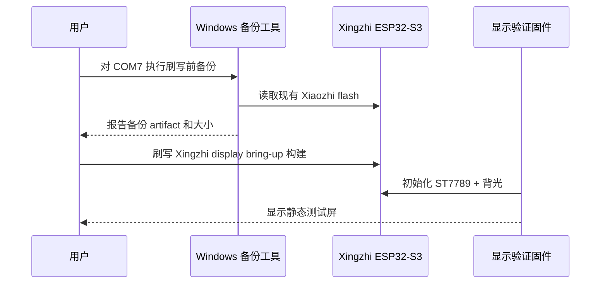

# feat: 将 Clawdmeter 适配为 Xingzhi 显示驱动验证

## 概述

第一阶段只做安全备份和 Xingzhi ST7789 显示 bring-up：新增一个隔离的 PlatformIO 构建目标，初始化 240x240 ST7789 屏幕和背光，并显示静态测试画面来确认屏幕能亮、颜色正确、方向正确。串口用量输入、240x240 用量仪表和 Windows 测试发送器全部推迟到显示驱动确认之后。

---

## 问题背景

用户设备当前运行 Xiaozhi 固件，串口日志识别为 `xingzhi-cube-1.54tft-wifi`。Clawdmeter 现有固件面向 Waveshare 480x480 AMOLED，耦合 BLE、触摸、PMU、IMU 旋转、LVGL 多屏 UI 和启动动画。为了降低第一轮刷写风险，应先证明目标板的 ST7789 屏幕、背光和基础绘制路径可用，再决定是否进入串口仪表适配。

---

## 阶段 1 需求

- R1. 刷写前必须备份现有 Xiaozhi 固件。
- R2. 备份步骤必须产出一个本地 artifact，并能检查存在和大小完整性。
- R3. 新构建目标必须面向 `xingzhi-cube-1.54tft-wifi` 硬件 profile。
- R4. 固件必须初始化 240x240 ST7789 SPI 显示屏和 GPIO13 背光。
- R5. 固件必须显示静态测试画面，包含颜色、边框和方向标记，便于判断颜色反转、坐标方向和裁切。
- R6. 第一阶段必须隔离或禁用 BLE、触摸、PMU 电池、IMU 旋转、splash 和用量仪表逻辑。
- R7. 第一阶段不应破坏现有 Waveshare 构建目标。

**来源需求处理:** 来源文档中的 R1-R3 直接进入本阶段；来源 R4-R8 中的“用量仪表、串口输入、Windows 发送器”推迟到后续阶段。

---

## 范围边界

- 不实现串口用量 JSON 输入。
- 不实现 240x240 用量仪表 UI。
- 不实现 Windows 串口测试发送器。
- 不实现 BLE GATT 数据传输或 BLE HID 快捷键。
- 不实现触摸交互、PMU 电池显示、IMU 自动旋转或 splash 动画。
- 不实现真实 Claude 用量轮询、daemon 或计划任务。

### 后续工作

- 阶段 2：在显示驱动已确认的基础上，实现 USB 串口用量输入和 240x240 用量仪表。
- 阶段 3：视需要恢复 BLE、HID、动画、触摸和真实主机轮询。

---

## 上下文与研究

### 相关代码和模式

- `firmware/platformio.ini` 当前只有 `waveshare_amoled_216` 环境，直接构建现有完整 Clawdmeter 固件。
- `firmware/src/display_cfg.h`、`firmware/src/main.cpp`、`firmware/src/ui.cpp` 和 `firmware/src/splash.cpp` 都假设 Waveshare 480x480 目标。
- 现有 Waveshare 入口包含 BLE、触摸、PMU、IMU、LVGL UI 和 splash；第一阶段不应把这些依赖带入 Xingzhi bring-up。
- 同级 `xiaozhi-esp32` 参考仓库中，`main/boards/xingzhi-cube-1.54tft-wifi/config.h` 给出了目标屏幕接线：SDA GPIO10、SCL GPIO9、DC GPIO8、CS GPIO14、RES GPIO18、BACKLIGHT GPIO13、240x240。
- 同级 `xiaozhi-esp32` 参考仓库中，`main/boards/xingzhi-cube-1.54tft-wifi/xingzhi-cube-1.54tft-wifi.cc` 使用 ST7789、SPI mode 3、80 MHz、RGB565、invert color true、无 swap、无 mirror。
- Windows Python 侧已确认 `pyserial 3.5` 和 `esptool 5.2.0` 可通过 `py -3` 使用。

### 外部参考

- Espressif esptool 文档确认 ESP32-S3 支持读取 flash 内容，可用于刷写前备份。
- Arduino_GFX 已是当前固件依赖，第一阶段优先复用它完成 ST7789 静态绘制。

---

## 关键技术决策

- 第一阶段使用最小显示 bring-up，而不是完整 Clawdmeter 应用：这能最快确认硬件显示，并避免 BLE/LVGL 多屏/用量逻辑干扰排查。
- 保留 PlatformIO/Arduino 路线：沿用现有工程形态和 Arduino_GFX 依赖，避免 ESP-IDF 重写。
- 新增独立 Xingzhi 环境，并通过 `src_filter` 或等效方式只编译显示验证入口：避免新 `setup()` / `loop()` 与现有 `main.cpp` 冲突，也避免把 BLE/PMU/IMU 依赖带入第一阶段。
- 第一阶段静态画面不依赖 LVGL：直接用 Arduino_GFX 画边框、色块、文字和方向标记，减少 bring-up 变量。
- 备份仍是第一个实施单元：即使只做显示驱动，也会覆盖设备上的 Xiaozhi 固件。
- 现有 Waveshare 环境保持 baseline：除必要的 `src_filter` 隔离外，不改它的运行行为。

---

## 未决问题

### 规划期间已解决

- 第一阶段范围：只做备份和显示驱动验证。
- 主机工具状态：Windows `pyserial` 和 `esptool` 已安装。
- UI 策略：第一阶段只显示静态测试屏，不做用量仪表。

### 延迟到实现阶段

- 精确 Arduino_GFX ST7789 类名和构造参数：实现时依据当前 Arduino_GFX 版本确认。
- 颜色反转和方向：先采用 Xiaozhi 设置，再用静态测试屏在实体设备上验证。
- 备份 flash 大小来源：优先使用 esptool 报告的 flash size，或实现时确认 `ALL` 读取路径是否可用。

---

## 输出结构

```text
docs/
  plans/2026-05-13-001-feat-xingzhi-display-bringup-plan.md
  xingzhi-display-bringup.md
tools/
  backup_xingzhi_flash.py
  tests/
    test_backup_xingzhi_flash.py
firmware/
  src/
    xingzhi_display_cfg.h
    xingzhi_display_bringup.cpp
```

---

## 高层技术设计

> *该图用于说明预期方案，是供评审使用的方向性指导，不是实现规范。实现者应把它作为上下文，而不是照抄代码或流程。*



---

## 实施单元

### U1. Xiaozhi Flash 备份工具

**目标:** 在任何 Clawdmeter 显示验证固件刷写前，读取并校验现有 Xiaozhi 固件备份。

**需求:** R1, R2.

**依赖:** 无。

**文件:**
- 新建: `tools/backup_xingzhi_flash.py`
- 新建: `tools/tests/test_backup_xingzhi_flash.py`
- 新建: `docs/xingzhi-display-bringup.md`

**方案:**
- 用 Python 包装 `py -3 -m esptool`，默认文档示例使用 `COM7`，但 port 必须可配置。
- 从 esptool 输出或可验证配置中确定 flash 大小，避免盲目硬编码。
- 备份完成后输出路径、字节大小和校验状态。
- 若备份缺失、大小不符或读取失败，后续刷写流程必须停止。

**遵循模式:**
- 主机工具放在 `tools/`，不混入 `firmware/`。
- 使用参数驱动脚本，不做常驻服务。

**测试场景:**
- Happy path：mock esptool 成功读取后，脚本报告备份路径和大小。
- Error path：esptool 不可调用时，输出明确错误并退出。
- Error path：输出文件为 0 字节或大小不足时，校验失败。
- Integration：在 `COM7` 上手动运行，刷写前产生可检查的备份 artifact。

**验证:**
- 用户在刷写前拥有一个可定位、大小符合预期的 Xiaozhi 备份文件。

---

### U2. Xingzhi 显示验证构建目标

**目标:** 新增一个隔离的 PlatformIO 环境，只编译 Xingzhi 显示验证入口，不编译完整 Clawdmeter 应用。

**需求:** R3, R6, R7.

**依赖:** U1。

**文件:**
- 修改: `firmware/platformio.ini`
- 新建: `firmware/src/xingzhi_display_cfg.h`
- 新建: `firmware/src/xingzhi_display_bringup.cpp`

**方案:**
- 新增 `xingzhi_display_bringup` 或同等命名的 PlatformIO environment。
- 为现有 `waveshare_amoled_216` 环境排除新 bring-up 入口，避免 duplicate `setup()` / `loop()`。
- 为 Xingzhi 环境只包含显示验证入口和必要依赖，避免 BLE、PMU、IMU、touch、LVGL UI 和 splash 编译进第一阶段。
- 在 `xingzhi_display_cfg.h` 中记录目标引脚、分辨率和初始显示参数，来源标注为 Xiaozhi board profile。

**遵循模式:**
- 现有 `firmware/platformio.ini` 的 board/build flag 风格。
- Arduino 入口仍使用标准 `setup()` / `loop()`。

**测试场景:**
- Happy path：Xingzhi display bring-up 环境可以独立编译。
- Regression：Waveshare 环境仍能编译，且不会编译新的 bring-up 入口。
- Error path：如果 Arduino_GFX ST7789 类型或参数不匹配，编译失败应集中在 bring-up 入口，而不是影响原应用。

**验证:**
- 两个 PlatformIO 环境互相隔离；第一阶段改动不会改变原 Waveshare 应用入口。

---

### U3. ST7789 与背光静态测试屏

**目标:** 初始化 Xingzhi 的 ST7789 SPI 显示屏和 GPIO13 背光，并绘制用于硬件判断的静态测试画面。

**需求:** R4, R5.

**依赖:** U2。

**文件:**
- 修改: `firmware/src/xingzhi_display_bringup.cpp`
- 修改: `firmware/src/xingzhi_display_cfg.h`

**方案:**
- 以 Xiaozhi 设置为初始值：240x240、SDA GPIO10、SCL GPIO9、DC GPIO8、CS GPIO14、RES GPIO18、BACKLIGHT GPIO13、SPI mode 3、invert color true、无 swap、无 mirror。
- 直接使用 Arduino_GFX 进行静态绘制，不进入 LVGL。
- 测试屏包含外框、四角方向标记、RGB 色块、黑白灰阶块、屏幕尺寸文字和构建标识。
- 串口日志输出 board target、引脚、分辨率、背光状态和绘制完成状态。
- `loop()` 保持轻量，仅周期性输出心跳或保持画面。

**遵循模式:**
- 使用现有 Arduino_GFX 依赖。
- 参考 Xiaozhi ST7789 初始化参数，但不复制 ESP-IDF panel 代码结构。

**测试场景:**
- Happy path：刷写后屏幕点亮并显示完整测试画面。
- Edge case：颜色异常时，可通过 RGB 色块判断是否需要调整 invert color 或色序。
- Edge case：方向异常时，可通过四角标记判断 rotation、mirror 或 swap 设置。
- Integration：实体设备上确认背光受控、画面不裁切、240x240 边框完整。

**验证:**
- 用户能从静态测试屏判断：屏幕已点亮、方向正确或可诊断、颜色正确或可诊断、背光正常。

---

### U4. 显示验证运行手册

**目标:** 记录第一阶段的安全操作顺序和硬件观察项。

**需求:** R1, R2, R3, R4, R5, R6, R7.

**依赖:** U1, U2, U3。

**文件:**
- 新建: `docs/xingzhi-display-bringup.md`
- 修改: `README.md`
- 修改: `AGENTS.md`

**方案:**
- 文档顺序必须是：确认 Windows 工具、备份 Xiaozhi、构建 display bring-up、刷写、观察测试屏、记录颜色/方向/背光结果。
- 明确第一阶段不包含串口用量输入和用量仪表。
- 记录下一阶段进入条件：静态测试屏验证通过后，才继续做串口仪表。
- 如新增 board target 或 `src_filter` 约定会影响后续 agent，应在 `AGENTS.md` 增加简短说明。

**遵循模式:**
- 文档保持短、直接、可执行。
- 避免写入机器专属绝对路径。

**测试场景:**
- Test expectation: none -- 文档单元通过人工按 checklist 走通来验证。

**验证:**
- 新实现者可以按文档完成备份、构建、刷写和显示观察，不需要理解完整 Clawdmeter BLE/仪表路径。

---

## 系统级影响

- **交互图:** 第一阶段不进入用量数据链路，只验证显示硬件路径。
- **错误传播:** 失败应表现为编译失败、串口初始化日志、黑屏或测试图异常，而不是混入 BLE 或 UI 状态。
- **状态生命周期风险:** 不引入 `UsageData` 状态变更；后续串口仪表阶段再处理 no-data/invalid-payload 状态。
- **API 表面一致性:** 原 Clawdmeter UI 和 BLE API 不在本阶段扩展。
- **集成覆盖:** 显示正确性必须通过实体硬件观察验证，单元测试无法替代。
- **不变约束:** Waveshare 环境应保持原行为；第一阶段只允许为构建隔离做最小配置调整。

---

## 风险与依赖

| 风险 | 缓解 |
|------|------|
| 刷写覆盖 Xiaozhi 固件 | U1 先做备份并校验 artifact。 |
| 新 bring-up 入口导致原环境 duplicate `setup()` / `loop()` | 用 PlatformIO `src_filter` 或等效隔离规则，两个环境分别编译各自入口。 |
| Arduino_GFX ST7789 参数与 Xiaozhi ESP-IDF 参数不完全等价 | 先编译确认，再用静态测试屏观察颜色、方向和裁切。 |
| 黑屏无法判断是背光还是 SPI 初始化问题 | 串口日志分别报告背光 GPIO 设置、display begin 状态和绘制完成状态。 |
| 计划过早扩大到串口仪表 | 明确把串口输入、用量仪表和 Windows 发送器移入后续工作。 |

---

## 文档 / 运行说明

- 第一阶段安全顺序：备份 Xiaozhi -> 构建 Xingzhi display bring-up -> 刷写 -> 观察静态测试屏。
- 串口仪表阶段只有在显示测试屏验证通过后再启动。
- 实现时如果用户决定恢复完整计划，应新建或修订阶段 2 plan，而不是把串口功能塞回本阶段。

---

## 来源与参考

- **来源文档:** [docs/brainstorms/2026-05-13-xingzhi-clawdmeter-adaptation-requirements.md](../brainstorms/2026-05-13-xingzhi-clawdmeter-adaptation-requirements.md)
- Clawdmeter 固件目标: `firmware/platformio.ini`
- 当前 Waveshare 显示和硬件入口: `firmware/src/display_cfg.h`, `firmware/src/main.cpp`
- 同级仓库 `xiaozhi-esp32` 中的 Xiaozhi board profile: `main/boards/xingzhi-cube-1.54tft-wifi/config.h`
- 同级仓库 `xiaozhi-esp32` 中的 Xiaozhi ST7789 初始化: `main/boards/xingzhi-cube-1.54tft-wifi/xingzhi-cube-1.54tft-wifi.cc`
- Espressif esptool 文档: <https://docs.espressif.com/projects/esptool/en/latest/esp32s3/esptool/basic-commands.html>
