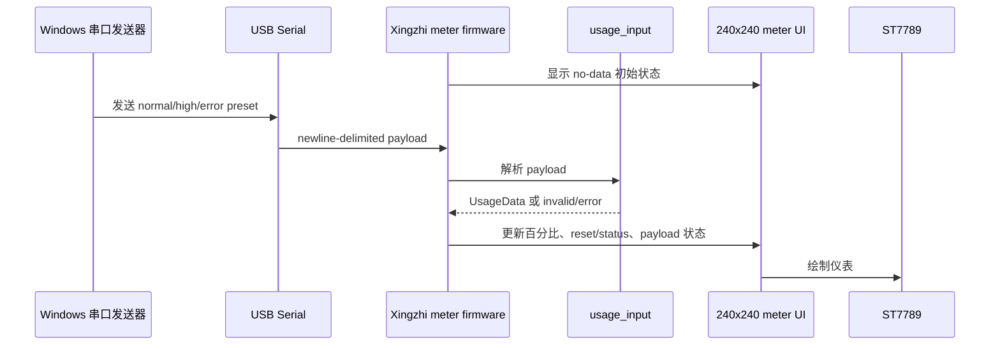

# feat: 将 Xingzhi 显示验证推进为串口用量仪表

## 概述

阶段 2 在 Xingzhi ST7789 显示验证通过后，把静态测试屏推进为可用的 240x240 串口用量仪表。它复用阶段 1 已验证的显示和背光配置，新增 USB 串口 payload 输入、紧凑用量 UI、Windows 手动测试发送器和验证文档；BLE、HID、daemon 和真实 Claude 轮询仍然推迟。

---

## 前置条件

- `docs/plans/2026-05-13-001-feat-xingzhi-display-bringup-plan.md` 已完成或等效验证已完成。
- Xiaozhi 固件备份 artifact 已存在并通过大小校验。
- Xingzhi 屏幕已确认能点亮，颜色、方向、背光和边框显示结果已有记录。
- 设备仍可通过 Windows 串口访问，默认按 `COM7` 处理，但工具必须允许覆盖 port。

---

## 阶段 2 需求

- R1. 固件必须在已验证的 Xingzhi ST7789 显示配置上启动 240x240 用量仪表。
- R2. 仪表必须显示 session 百分比、weekly 百分比、reset 时间或状态，以及最近 payload 是否有效。
- R3. 固件必须通过 USB 串口接收 newline-delimited 测试用量 payload，不要求 BLE 配对。
- R4. payload 字段应复用现有 Clawdmeter `UsageData` 语义：`s`、`sr`、`w`、`wr`、`st`、`ok`、`valid`。
- R5. 无数据、normal、高用量、invalid/error 四种状态都必须有可观察的屏幕表现。
- R6. Windows 侧必须提供手动运行的串口测试发送器，支持 normal、high-usage、invalid/error preset。
- R7. 第一版不实现 BLE GATT、BLE HID、后台 daemon、真实 Claude 轮询或触摸交互。
- R8. 不破坏阶段 1 display bring-up 环境和原 Waveshare 环境。

**来源需求处理:** 本阶段承接来源文档 R4-R8；来源 R1-R3 已由阶段 1 覆盖并作为前置条件。

---

## 范围边界

- 不修改阶段 1 的静态 display bring-up 目标，除非需要共享已验证配置。
- 不实现 BLE 数据传输或键盘 HID 快捷键。
- 不实现 Windows 后台服务、计划任务或真实 Claude 用量 API 轮询。
- 不实现触摸导航、PMU 电池状态、IMU 自动旋转或 splash 动画。
- 不把 WSL 串口访问作为主路径。

### 后续工作

- 阶段 3 可恢复 BLE GATT 数据通道、BLE HID、daemon 化轮询、真实 Claude 用量采集、触摸或物理按键交互。

---

## 上下文与研究

### 相关代码和模式

- 阶段 1 计划新增 `firmware/src/xingzhi_display_cfg.h` 和 `firmware/src/xingzhi_display_bringup.cpp`，其中的显示参数是本阶段的硬件基础。
- `firmware/src/data.h` 定义了 `UsageData`，现有 `main.cpp` 的 `parse_json` 已有 compact payload 字段映射。
- `firmware/src/ui.cpp` 当前是 Waveshare 480x480 多屏 UI，包含 splash、usage、Bluetooth 和电池/Logo overlay，不适合直接作为 240x240 第一版照搬。
- `firmware/src/main.cpp` 当前耦合触摸、PMU、IMU、BLE、splash 和按钮行为；本阶段应继续使用独立 Xingzhi entry point，避免把这些依赖带回阶段 2。
- Windows Python 侧已确认 `pyserial 3.5` 和 `esptool 5.2.0` 可通过 `py -3` 使用。

### 外部参考

- pySerial 文档确认 Python 可以打开命名串口、配置 baud/timeout 并写入 newline-terminated bytes。
- LVGL 已是当前固件依赖；如果阶段 2 使用 LVGL，应只初始化本仪表需要的最小 display/buffer/flush 路径。

---

## 关键技术决策

- 保留阶段 1 的显示验证目标：阶段 2 新增或切换到 `xingzhi_serial_meter` 环境，不删除 display bring-up 环境，方便回归硬件排查。
- 使用独立 Xingzhi meter entry point：避免改动原 Waveshare `main.cpp` 的 BLE/触摸/PMU/IMU 运行路径。
- 串口 payload 复用 `UsageData` 语义：让后续 BLE 或 daemon 恢复时可以重用同一仪表状态模型。
- 第一版 UI 只做单屏：240x240 空间有限，先显示核心百分比、reset/status 和 payload 状态，不做 splash 或 Bluetooth 屏。
- invalid/error 是屏幕状态，不只是串口日志：用户需要直接从设备上判断最近一次测试是否成功。
- Windows sender 只做手动验证：不常驻、不调 Claude API、不写计划任务。

---

## 未决问题

### 规划期间已解决

- 阶段 2 不重新做显示驱动 bring-up，只复用已验证 ST7789 配置。
- 主机测试路径使用 Windows Python + pySerial，默认 `COM7`。
- BLE、HID、daemon、真实轮询继续推迟。

### 延迟到实现阶段

- 最终用 LVGL 还是 Arduino_GFX 直接绘制仪表：优先按实现复杂度选择，若 LVGL buffer/flush 路径过重，可直接用 Arduino_GFX 绘制静态/周期更新 UI。
- `invalid/error` payload 的精确协议：可选择 malformed JSON 或显式 `{ "ok": false, "st": "error" }`，但 firmware 和 sender 必须一致。
- 百分比、reset 文本和状态在 240x240 上的最终排版：以实体屏幕观察为准。

---

## 输出结构

```text
docs/
  plans/2026-05-13-002-feat-xingzhi-serial-meter-plan.md
  xingzhi-serial-meter.md
tools/
  send_test_payload.py
  tests/
    test_send_test_payload.py
firmware/
  src/
    usage_input.h
    usage_input.cpp
    xingzhi_meter_app.cpp
    xingzhi_meter_ui.h
    xingzhi_meter_ui.cpp
    meter_format.h
    meter_format.cpp
  test/
    test_usage_input/
      test_main.cpp
    test_meter_format/
      test_main.cpp
```

---

## 高层技术设计

> *该图用于说明预期方案，是供评审使用的方向性指导，不是实现规范。实现者应把它作为上下文，而不是照抄代码或流程。*



---

## 实施单元

### U1. Xingzhi 串口仪表固件入口

**目标:** 新增阶段 2 固件入口和 PlatformIO 环境，在阶段 1 显示配置上启动 meter app。

**需求:** R1, R7, R8.

**依赖:** 阶段 1 display bring-up 已验证。

**文件:**
- 修改: `firmware/platformio.ini`
- 新建: `firmware/src/xingzhi_meter_app.cpp`
- 复用或修改: `firmware/src/xingzhi_display_cfg.h`

**方案:**
- 新增 `xingzhi_serial_meter` 或同等命名的 PlatformIO environment。
- 通过 `src_filter` 或等效机制，只编译 meter 入口、显示配置、串口解析和 meter UI。
- 保留 `xingzhi_display_bringup` 环境，作为硬件回归验证工具。
- 初始化串口、已验证 ST7789 显示、必要绘图栈和 no-data 初始 UI。

**遵循模式:**
- 阶段 1 的 `xingzhi_display_cfg.h` 引脚和显示参数。
- 现有 PlatformIO build flag 风格。

**测试场景:**
- Happy path：`xingzhi_serial_meter` 环境能独立编译。
- Regression：`xingzhi_display_bringup` 和 `waveshare_amoled_216` 环境仍能编译或兼容性差异被明确记录。
- Integration：实体设备刷写后显示 no-data 初始仪表，而不是静态测试图或空白屏。

**验证:**
- 阶段 2 固件入口和阶段 1 display bring-up 入口可独立选择、互不覆盖。

---

### U2. 串口 UsageData 输入模块

**目标:** 从 USB 串口读取 newline-delimited payload，并转换为 `UsageData` 或 invalid/error 状态。

**需求:** R3, R4, R5.

**依赖:** U1。

**文件:**
- 新建: `firmware/src/usage_input.h`
- 新建: `firmware/src/usage_input.cpp`
- 修改: `firmware/src/data.h`
- 测试: `firmware/test/test_usage_input/test_main.cpp`

**方案:**
- 将现有 `main.cpp` 中的 JSON 字段映射提取到可测试模块。
- 支持字段 `s`、`sr`、`w`、`wr`、`st`、`ok`，并显式管理 `valid`。
- 串口输入以 newline 作为消息边界。
- 对过长行、空行、malformed JSON 和显式 error payload 做可预测处理。
- 保留 `screenshot` 命令的可选空间，但只有不干扰 payload 路由时才实现。

**执行说明:** 先补 parser 和 line-buffer 的 characterization 测试，再接入 firmware loop。

**遵循模式:**
- 现有 `UsageData` 字段含义。
- ArduinoJson 作为当前固件 JSON 解析依赖。

**测试场景:**
- Happy path：有效 payload 更新 session、weekly、reset、status、ok、valid。
- Edge case：缺失 `sr` 或 `wr` 时沿用 `-1` reset 语义。
- Edge case：空行不改变现有状态。
- Error path：malformed JSON 产出 invalid/error 状态，不崩溃。
- Error path：过长行被丢弃，不污染下一条有效 payload。

**验证:**
- 固件每收到一个完整串口 payload，只产生一次明确状态更新。

---

### U3. 240x240 用量仪表 UI

**目标:** 实现适配 Xingzhi 240x240 屏幕的单屏用量仪表。

**需求:** R1, R2, R5.

**依赖:** U1, U2。

**文件:**
- 新建: `firmware/src/xingzhi_meter_ui.h`
- 新建: `firmware/src/xingzhi_meter_ui.cpp`
- 新建: `firmware/src/meter_format.h`
- 新建: `firmware/src/meter_format.cpp`
- 测试: `firmware/test/test_meter_format/test_main.cpp`

**方案:**
- UI 显示 session 百分比、weekly 百分比、reset 时间或状态，以及 latest payload 状态。
- no-data、normal、high-usage、invalid/error 四种状态要有不同可观察表现。
- 将百分比、reset 文本、状态标签等格式化逻辑放入可测试 helper，绘制层只负责布局和渲染。
- 先采用保守布局：大数字、短标签、两条小进度条或等效色块，避免 240x240 文本溢出。
- 如果使用 LVGL，只初始化 meter UI 所需的最小对象；如果直接用 Arduino_GFX 绘制，保留清屏/局部重绘策略，避免闪烁过重。

**遵循模式:**
- 现有 `pct_color` 阈值思路：低用量、警告、高用量状态分层。
- 阶段 1 的方向/颜色验证结果。

**测试场景:**
- Happy path：no-data 状态显示 placeholder 和等待状态。
- Happy path：normal payload 显示两个百分比和 reset 文本。
- Edge case：80% 以上高用量进入 high-usage 视觉状态。
- Error path：invalid/error payload 显示最近 payload 异常，不清空已有可用读数。
- Integration：实体屏幕确认文本不裁切、边距合理、颜色和方向正确。

**验证:**
- 用户无需看串口日志，也能从屏幕判断当前用量状态和最近 payload 是否有效。

---

### U4. Windows 串口测试发送器

**目标:** 提供手动运行的 Windows Python 工具，向设备发送 normal、high-usage、invalid/error preset。

**需求:** R3, R5, R6.

**依赖:** U2, U3。

**文件:**
- 新建: `tools/send_test_payload.py`
- 新建: `tools/tests/test_send_test_payload.py`
- 修改: `docs/xingzhi-serial-meter.md`

**方案:**
- 使用 pySerial 打开 Windows port，默认示例为 `COM7` 和 115200 baud。
- 提供 `normal`、`high`、`invalid` 或等效 preset。
- 支持 dry-run/print-only，便于无硬件测试 payload 生成。
- 发送前打印 payload；发送时写入 newline-terminated bytes。
- 串口打开失败时输出明确错误，包含 port 名称和处理建议。

**遵循模式:**
- 与 U2 的 payload 协议保持一致。
- 工具保持手动执行，不做后台服务。

**测试场景:**
- Happy path：normal preset 生成低/中用量 JSON。
- Happy path：high preset 生成高用量 JSON。
- Error path：invalid preset 生成 U2 能识别的 invalid/error 输入。
- Error path：串口不可用时返回清晰错误。
- Integration：对 `COM7` 发送三类 preset，实体屏幕分别显示 normal、high-usage、invalid/error 状态。

**验证:**
- 用户可以不写 JSON，直接通过 preset 验证仪表状态切换。

---

### U5. 阶段 2 文档和验证手册

**目标:** 记录从显示验证通过到串口仪表验证通过的操作流程。

**需求:** R1, R2, R3, R4, R5, R6, R7, R8.

**依赖:** U1, U2, U3, U4。

**文件:**
- 新建: `docs/xingzhi-serial-meter.md`
- 修改: `README.md`
- 修改: `AGENTS.md`

**方案:**
- 文档说明阶段 2 前置条件：阶段 1 显示验证通过、Xiaozhi 备份存在。
- 记录构建环境、刷写注意事项、串口发送器 preset、预期屏幕状态和失败排查路径。
- 明确阶段 2 仍不包含 BLE、daemon、真实轮询和触摸交互。
- 如果新增了 `xingzhi_serial_meter` 环境或 meter UI 文件约定，在 `AGENTS.md` 增加简短说明。

**遵循模式:**
- 保持文档短、直接、可执行。
- 避免绝对路径和机器专属配置。

**测试场景:**
- Test expectation: none -- 文档单元通过按 checklist 完成一次实体设备验证来确认。

**验证:**
- 新实现者能按文档从阶段 1 进入阶段 2，并完成 normal/high/error 三类串口仪表验证。

---

## 系统级影响

- **交互图:** 阶段 2 新增 USB serial -> usage parser -> meter UI 的数据链路，不进入 BLE/daemon 链路。
- **错误传播:** payload 解析失败必须进入 UI 可见状态，同时保留串口日志方便排查。
- **状态生命周期风险:** no-data、valid、invalid/error 和 last-good readings 的关系需要明确，避免旧读数被误认为最新成功数据。
- **API 表面一致性:** `UsageData` 继续作为后续 BLE/daemon 恢复的共享状态模型。
- **集成覆盖:** 单元测试只能覆盖 parser/format；屏幕布局、颜色、方向和串口到屏幕更新必须实体验证。
- **不变约束:** 阶段 1 display bring-up 和原 Waveshare 环境必须可继续用于回归。

---

## 风险与依赖

| 风险 | 缓解 |
|------|------|
| 阶段 2 又把范围扩大回完整产品 | 明确只做串口手动输入和单屏仪表，BLE/daemon/真实轮询推迟。 |
| UI 在 240x240 上不可读 | 用单屏、短标签和实体屏幕验证；必要时减少文字。 |
| invalid/error 协议在 sender 和 firmware 间不一致 | U2 先定义并测试协议，U4 按同一协议生成 preset。 |
| 串口输入阻塞 UI loop | 使用非阻塞串口读取和 bounded line buffer。 |
| 保留多个 PlatformIO 环境导致构建混淆 | 文档和 `AGENTS.md` 明确每个环境用途：bring-up、serial-meter、waveshare。 |

---

## 文档 / 运行说明

- 阶段 2 只能在阶段 1 显示测试屏验证通过后开始。
- 第一条验证路径是：构建 `xingzhi_serial_meter` -> 刷写 -> 观察 no-data -> 发送 normal -> 发送 high -> 发送 invalid/error。
- 如果实体屏幕仍有颜色/方向问题，应退回阶段 1 display bring-up 环境排查，不应在 meter UI 中硬补。

---

## 来源与参考

- **来源文档:** [docs/brainstorms/2026-05-13-xingzhi-clawdmeter-adaptation-requirements.md](../brainstorms/2026-05-13-xingzhi-clawdmeter-adaptation-requirements.md)
- **前置计划:** [docs/plans/2026-05-13-001-feat-xingzhi-display-bringup-plan.md](2026-05-13-001-feat-xingzhi-display-bringup-plan.md)
- 当前用量数据契约: `firmware/src/data.h`
- 当前 BLE payload 解析来源: `firmware/src/main.cpp`
- 当前 Waveshare UI 参考: `firmware/src/ui.cpp`
- 阶段 1 显示配置: `firmware/src/xingzhi_display_cfg.h`
- pySerial API 文档: <https://pyserial.readthedocs.io/en/latest/pyserial.html>
