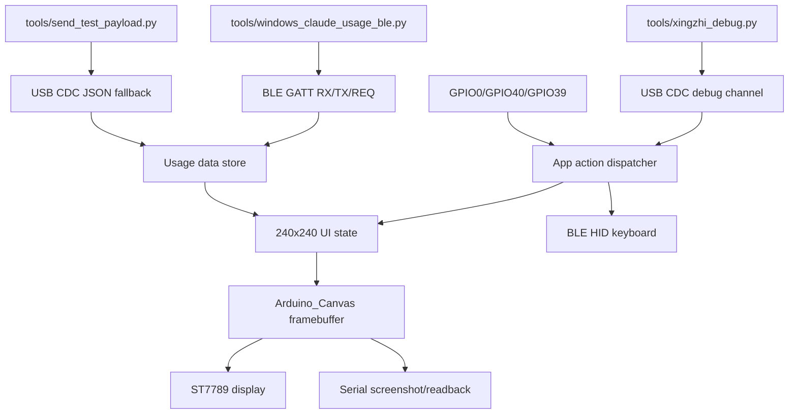
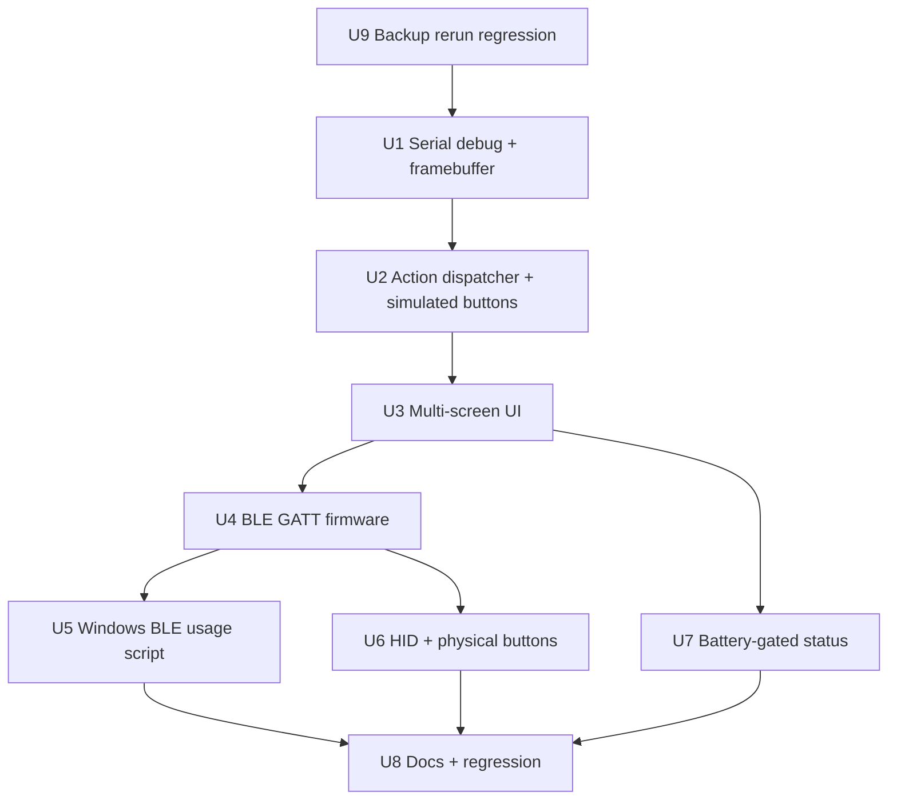

# feat: 补齐 Xingzhi 原版核心体验

## Summary

本计划新增一个独立的 Xingzhi parity 固件目标，在不破坏已验证 `xingzhi_serial_meter` 的前提下，逐段补齐串口调试、240x240 多屏 UI、BLE 用量传输、Windows 主机脚本、HID 快捷键和可验证的电池状态。每一段都必须先通过串口截图/状态/模拟按键等调试闸门，再进入下一段实现。

---

## Problem Frame

当前 Xingzhi 版本已经完成备份、ST7789 显示 bring-up 和 USB 串口用量仪表验证，但它仍缺少原版 Clawdmeter 的无线用量更新、多屏交互、HID 快捷键和可自助调试的实体 UI 闭环。下一步不能把原版 Waveshare 的 LVGL、触摸、PMU 和 480x480 假设直接搬过来，而应围绕 Xingzhi 的 240x240 ST7789、三颗物理按键和 Windows 主机路径做小步补齐。

---

## Assumptions

*本计划是在当前会话中按用户最新 `$ce-plan` 请求直接生成的。以下是实现前应重点复核的计划期推断。*

- 新功能使用新的 `xingzhi_parity` PlatformIO 环境承载，而不是扩展 `xingzhi_serial_meter`。
- 串口调试命令使用非 JSON 前缀，与现有 newline-delimited JSON 用量 payload 共用 USB CDC。
- 240x240 截图优先通过 Arduino_GFX 的 `Arduino_Canvas` framebuffer 回读实现，不引入 LVGL。
- Windows 主机脚本优先使用 Python Bleak，而不是移植 Linux BlueZ D-Bus daemon。
- 第一版调试按键覆盖三颗按钮的 click/press/release 应用动作；long-press 行为不作为第一版阻塞项。

---

## Requirements

- R1. 串口调试通道必须先于 BLE、HID 和视觉补齐落地。
- R2. 串口调试必须支持 Codex 可用的 240x240 屏幕截图或 framebuffer 回读。
- R3. 串口调试必须支持模拟三颗实体按键对应的应用层动作。
- R4. 串口调试命令必须与现有串口用量测试 payload 共存，保留 USB 验证能力。
- R5. UI 必须提供 usage、Bluetooth/status、splash 三个紧凑核心屏幕。
- R6. Usage 屏继续显示 session、weekly、reset/status 和数据有效性。
- R7. Bluetooth/status 屏显示连接状态、错误和恢复路径。
- R8. Splash 屏只做占位和基本视觉识别，不实现完整 Clawd 动画。
- R9. 只有硬件读数经验证后，才把电池/充电状态放入可见 UI。
- R10. 日常用量更新通过 BLE GATT，不以 USB 串口作为正式用户数据路径。
- R11. Windows 主机路径是手动启动的原生脚本。
- R12. Windows 脚本记录发现、连接、更新、失败和重连。
- R13. BLE 引入后，USB 串口用量输入继续作为调试/救援 fallback。
- R14. 三颗物理按键分配为 UI/splash 切换、BLE HID `Space`、BLE HID `Shift+Tab`。
- R15. HID 行为独立于用量数据传输。
- R16. 已有备份、display bring-up 和 serial meter 工作流继续可用。
- R17. 不有意破坏原 Waveshare 目标。
- R18. 实现必须拆成多个可独立验证的段。
- R19. 每段完成后必须先通过串口调试验证闸门，再继续下一段。
- R20. 串口调试基础作为最早阻塞段完成。

**Origin actors:** A1 用户, A2 Codex, A3 Xingzhi 设备, A4 Windows 主机, A5 后续规划/实现者
**Origin flows:** F1 串口调试闭环, F2 真实 BLE 用量更新, F3 日常设备交互
**Origin acceptance examples:** AE1 截图回读, AE2 串口模拟切屏, AE3 Windows BLE 更新, AE4 串口 fallback, AE5 HID 快捷键, AE6 Bluetooth/status 恢复提示, AE7 每段串口验证闸门

---

## Scope Boundaries

- 不实现原版完整 Clawd 动画系统。
- 不构建 Windows 托盘应用、安装器、服务或开机自启。
- Linux/BlueZ daemon 不作为本阶段主路径。
- 不补齐 Xingzhi 没有的触摸交互或 IMU 自动旋转。
- 不把原 Waveshare 应用重构作为 Xingzhi 补齐的一部分。
- 串口调试通道不是最终用户用量传输路径。

### Deferred to Follow-Up Work

- 完整 splash 动画和更精细的视觉资产：等待核心 BLE/HID/debug 闭环稳定后单独规划。
- Windows 托盘化、安装器、自启动和长期驻留：本计划只交付手动启动 CLI。
- 原 Waveshare 目标重构：仅做必要回归保护，不主动改造。

---

## Context & Research

### Relevant Code and Patterns

- `firmware/platformio.ini`: 当前已有 `xingzhi_display_bringup` 和 `xingzhi_serial_meter` 隔离环境；新功能应延续隔离目标模式。
- `firmware/src/xingzhi_meter_app.cpp`: 已验证 ST7789 初始化、USB serial payload、Arduino_GFX 绘制和 COM7 调试节奏。
- `firmware/src/xingzhi_meter_ui.cpp`: 现有 240x240 usage UI 是可复用的视觉基础，但直接画屏，没有可回读 framebuffer。
- `firmware/src/usage_input.cpp` 与 `firmware/test/test_usage_input/test_main.cpp`: newline-delimited JSON payload 和解析测试应继续作为串口 fallback 基础。
- `firmware/src/ble.cpp` 与 `firmware/src/ble.h`: 原版自定义 GATT UUID、REQ/TX/RX 特征、NimBLE HID keyboard、ack/nack 和 refresh request 是迁移参考。
- `firmware/src/main.cpp`: 原版 screenshot 命令、BLE payload 处理和三按钮动作提供行为基线，但 480x480 LVGL snapshot 不适合直接用于 Xingzhi。
- `daemon/claude-usage-daemon.sh`: Linux daemon 展示了 Claude usage header 轮询、payload 形状、REQ 通知和重连策略；Windows 端应复用协议意图而不是复用 BlueZ 实现。
- `screenshot.sh`: 原版串口截图的 framed raw RGB565 传输可复用为协议参考，但尺寸和转码工具需要适配 240x240/Windows。
- `tools/send_test_payload.py` 与 `tools/tests/test_send_test_payload.py`: Python CLI、lazy dependency import、fake serial 测试是新主机工具应遵循的风格。
- `tools/backup_xingzhi_flash.py` 与 `tools/tests/test_backup_xingzhi_flash.py`: code review 发现 chunked backup 在中断后重跑时会因已有 `.chunks` 目录失败；该备份工作流属于 R16 兼容性前置修复。
- Local `xiaozhi-esp32` reference checkout, `main/boards/xingzhi-cube-1.54tft-wifi/config.h`: 确认 ST7789 引脚、240x240 尺寸、GPIO0/GPIO40/GPIO39 三颗按键。
- Local `xiaozhi-esp32` reference checkout, `main/boards/xingzhi-cube-1.54tft-wifi/power_manager.h`: 电池读数来自 GPIO38 charging 和 ADC2 channel 6，必须先用串口状态验证再显示。

### Institutional Learnings

- 仓库当前没有 `docs/solutions/` 或 `.planning/` 可复用学习文档。
- `AGENTS.md` 明确要求保持 `xingzhi_display_bringup` 和 `xingzhi_serial_meter` 隔离，不在这些环境里直接加入 BLE/HID/splash/real polling。

### External References

- Bleak client API supports async scan/connect, `write_gatt_char(..., response=True|False)`, and notifications through `start_notify`: https://bleak.readthedocs.io/en/latest/api/client.html
- Bleak Windows backend provides native WinRT BLE client support: https://bleak.readthedocs.io/en/latest/backends/windows.html

---

## Key Technical Decisions

- 新建 `xingzhi_parity` 环境：保护已验证串口仪表和 display bring-up，使补齐工作可以独立构建、刷写和回滚。
- 使用 `Arduino_Canvas` 作为渲染目标：同一帧既能 flush 到 ST7789，也能通过 `getFramebuffer()` 被串口调试工具回读，避免为 240x240 目标引入 LVGL snapshot。
- 串口协议采用命令前缀分流：以 JSON object 开头的行继续走 usage fallback，调试命令走非 JSON 前缀，避免破坏 `tools/send_test_payload.py` 的现有路径。
- 应用动作集中到 action dispatcher：物理按键、串口模拟按键和后续 HID 行为共用一套应用动作，降低按键逻辑分叉。
- 先移植原版 GATT 数据服务，再接入 Windows CLI：固件先暴露可观察的 BLE 状态，Windows 脚本随后完成真实数据闭环。
- BLE GATT 与 HID 共用原版 NimBLE 模式：沿用 `firmware/src/ble.cpp` 的服务/特征/HID report map 思路，但封装为 Xingzhi 目标专用模块，避免影响 Waveshare。
- 电池 UI 受验证闸门控制：只有串口 status 返回的充电/电量读数稳定可信后，才在 status 屏显示；否则保留内部状态和文档说明。

---

## Open Questions

### Resolved During Planning

- 串口截图/回读表示：使用 240x240 RGB565 framebuffer framed binary 输出，主机工具负责转 PNG/PPM，并保留原始尺寸/格式元数据。
- 模拟按键第一版范围：覆盖三颗键的 click/press/release 应用动作；long-press 不是第一版阻塞项。
- 串口通道兼容方式：按输入行前缀分流，JSON payload 保持现有用法，调试命令不以 `{` 开头。
- Windows BLE 机制：使用 Python Bleak CLI，手动启动，输出结构化日志；不做托盘、服务或安装器。
- BLE/HID 共存策略：延续原版 NimBLE peripheral + custom GATT + HID keyboard 的架构，在独立 Xingzhi 环境中验证。

### Deferred to Implementation

- `Arduino_Canvas` flush 频率和内存分配方式：需在真实板上确认帧率、堆内存和 PSRAM/DRAM 行为。
- Windows 端 Claude usage 轮询的最终容错细节：需在用户机器真实凭据和网络环境下验证 header 可用性。
- BLE bonding 和 Windows 缓存恢复流程：需通过实际配对、断开、清 bond、重连观察确定 UI 文案和日志细节。
- 电池 ADC 标定是否适合该个体硬件：需用串口 status 多次采样后决定是否展示。

---

## Output Structure

```text
firmware/src/
  xingzhi_parity_app.cpp
  xingzhi_debug_serial.{h,cpp}
  xingzhi_app_actions.{h,cpp}
  xingzhi_buttons.{h,cpp}
  xingzhi_ble.{h,cpp}
  xingzhi_power.{h,cpp}
  xingzhi_meter_ui.{h,cpp}
tools/
  xingzhi_debug.py
  windows_claude_usage_ble.py
tools/tests/
  test_xingzhi_debug.py
  test_windows_claude_usage_ble.py
firmware/test/
  test_xingzhi_debug_protocol/test_main.cpp
  test_xingzhi_app_actions/test_main.cpp
docs/
  xingzhi-parity.md
  xingzhi-serial-debug.md
```

---

## High-Level Technical Design

> *This illustrates the intended approach and is directional guidance for review, not implementation specification. The implementing agent should treat it as context, not code to reproduce.*



---

## Phased Delivery

- Phase 0: U9. Resolve the review-found backup chunk rerun regression before hardware work; this is a host-tool prerequisite and uses a unit-test gate, because the serial debug channel does not exist yet.
- Phase 1: U1 then U2. Establish serial screenshot/status and simulated actions before any BLE/HID/UI expansion.
- Phase 2: U3. Add multi-screen UI only after Codex can observe and drive screen changes through serial.
- Phase 3: U4 then U5. Bring up BLE firmware first, then Windows script, validating each step with serial status/screenshot.
- Phase 4: U6. Add HID and physical buttons after UI and BLE status are observable.
- Phase 5: U7 and U8. Add battery only if validated, then complete docs and regression coverage.



---

## Implementation Units

### U9. Backup chunk rerun regression

**Goal:** Fix the code-review finding where interrupted chunked flash backups leave an existing `.chunks` directory that prevents the next backup attempt from reaching cached chunk reuse.

**Requirements:** R16, R18; supports the backup/recovery workflow before new firmware work continues.

**Dependencies:** None

**Files:**
- Modify: `tools/backup_xingzhi_flash.py`
- Modify: `tools/tests/test_backup_xingzhi_flash.py`

**Approach:**
- Make chunk temp directory creation idempotent so interrupted runs can be resumed with the same output path.
- Preserve the existing cached chunk validation and cleanup behavior; do not change flash-read command construction.
- Add a regression test that pre-creates the chunk directory with one valid part, reruns the chunked backup, verifies only the missing chunk is read, and confirms successful cleanup.

**Patterns to follow:**
- Existing `test_chunked_backup_combines_parts`, `test_chunked_backup_retries_failed_part`, and `test_chunked_backup_splits_failed_part` tests.

**Test scenarios:**
- Happy path: rerun with existing chunk directory and valid first chunk reuses cached chunk and reads only missing chunks.
- Edge case: existing invalid cached chunk is discarded and reread.
- Error path: repeated chunk failure still returns a non-zero result without deleting a complete backup.

**Verification:**
- Unit-test gate: `tools/tests/test_backup_xingzhi_flash.py` covers interrupted chunked-backup rerun behavior.
- 串口调试闸门: Not applicable for this pre-device host-tool fix; U1 remains the first hardware segment and the first required serial screenshot/status gate.

---

### U1. Serial debug channel and framebuffer readback

**Goal:** Create the new `xingzhi_parity` target with a framebuffer-backed render path, debug status query, 240x240 screenshot/readback, and preserved serial JSON usage fallback.

**Requirements:** R1, R2, R4, R13, R16, R18, R19, R20; covers F1, AE1, AE4, AE7

**Dependencies:** None

**Files:**
- Modify: `firmware/platformio.ini`
- Create: `firmware/src/xingzhi_parity_app.cpp`
- Create: `firmware/src/xingzhi_debug_serial.h`
- Create: `firmware/src/xingzhi_debug_serial.cpp`
- Modify: `firmware/src/xingzhi_meter_ui.h`
- Modify: `firmware/src/xingzhi_meter_ui.cpp`
- Create: `tools/xingzhi_debug.py`
- Create: `tools/tests/test_xingzhi_debug.py`
- Create: `firmware/test/test_xingzhi_debug_protocol/test_main.cpp`
- Modify: `docs/xingzhi-serial-meter.md`
- Create: `docs/xingzhi-serial-debug.md`

**Approach:**
- Add a new PlatformIO environment that includes the existing Xingzhi display config, usage parser, meter formatting, UI code, debug serial module, and app shell.
- Route rendering through `Arduino_Canvas` connected to the existing ST7789 display driver so the active framebuffer can be streamed over serial.
- Define a framed binary screenshot response with width, height, pixel format, byte count, and end marker; keep host decoding tolerant of interleaved boot logs before the start marker.
- Add a status response that reports firmware target, current screen, payload state, last payload source, BLE placeholder state, uptime, and framebuffer availability.
- Preserve current newline JSON behavior by treating JSON object lines as usage payloads and non-JSON prefixed lines as debug commands.
- Extend the host debug tool to request status, capture screenshot, convert RGB565 to an image file using Python stdlib where practical, and keep raw output for diagnosis.

**Execution note:** Implement the protocol parser and host decoder test-first because this becomes the validation harness for later units.

**Patterns to follow:**
- `firmware/src/xingzhi_meter_app.cpp` for ST7789 init and serial lifecycle.
- `screenshot.sh` for framed raw screenshot transfer.
- `tools/send_test_payload.py` for Python CLI shape and fake serial tests.

**Test scenarios:**
- Happy path: debug status command after startup returns one parseable response naming `xingzhi_parity`, 240x240 dimensions, and no BLE connection.
- Happy path: screenshot command returns exactly one 240x240 RGB565 frame and the host tool writes a decodable image artifact.
- Happy path: sending the existing `high` JSON payload through serial updates usage state and status reports serial as the last data source.
- Edge case: debug tool ignores boot logs before the screenshot start marker.
- Edge case: empty serial lines are ignored and do not change payload state.
- Error path: malformed debug command returns an error response without being parsed as usage JSON.
- Error path: framebuffer allocation failure returns a structured screenshot error and does not crash the app.
- Integration: Covers AE1 and AE4. After a serial payload update, a screenshot readback shows the updated usage screen without user photo input.

**Verification:**
- 串口调试闸门: Codex can request status and screenshot from the flashed device, decode a 240x240 image, then send an existing serial JSON test payload and observe the status/screenshot change.
- `xingzhi_display_bringup` and `xingzhi_serial_meter` remain buildable as isolated targets.

---

### U2. Application actions and serial-simulated buttons

**Goal:** Introduce shared app actions for the three Xingzhi buttons and expose them through serial debug simulation before wiring physical GPIO or HID.

**Requirements:** R1, R3, R4, R14, R18, R19, R20; covers F1, F3, AE2, AE7

**Dependencies:** U1

**Files:**
- Create: `firmware/src/xingzhi_app_actions.h`
- Create: `firmware/src/xingzhi_app_actions.cpp`
- Modify: `firmware/src/xingzhi_parity_app.cpp`
- Modify: `firmware/src/xingzhi_debug_serial.h`
- Modify: `firmware/src/xingzhi_debug_serial.cpp`
- Modify: `tools/xingzhi_debug.py`
- Modify: `tools/tests/test_xingzhi_debug.py`
- Create: `firmware/test/test_xingzhi_app_actions/test_main.cpp`
- Modify: `docs/xingzhi-serial-debug.md`

**Approach:**
- Define app-level actions for screen cycle, HID-space intent, and HID-shift-tab intent without requiring BLE HID to exist yet.
- Support simulated click/press/release through the serial debug protocol; click is enough for screen cycling, while press/release prepares HID behavior.
- Record last action, action count, and current screen in debug status so Codex can validate behavior without relying only on image comparison.
- Keep action dispatch independent of serial parsing so later physical buttons and BLE HID call the same code path.

**Patterns to follow:**
- `firmware/src/main.cpp` original button handling for semantic mapping.
- `firmware/test/test_usage_input/test_main.cpp` for portable firmware unit test style.

**Test scenarios:**
- Happy path: simulated cycle click advances from usage to Bluetooth/status and status reports the new screen.
- Happy path: simulated HID-space press then release records a balanced intent without changing usage data.
- Happy path: simulated HID-shift-tab click records the correct action id.
- Edge case: unknown button id returns debug error and leaves screen unchanged.
- Edge case: repeated cycle clicks wrap across all registered screens.
- Error path: simulated release without prior press is handled predictably and reported in status.
- Integration: Covers AE2. Serial simulation changes the app screen, and a screenshot after the command shows the next screen.

**Verification:**
- 串口调试闸门: From the usage screen, Codex issues a simulated cycle action, then confirms both status and screenshot show the next screen before any UI expansion proceeds.

---

### U3. Compact 240x240 multi-screen UI

**Goal:** Expand the Xingzhi UI from a single usage meter into usage, Bluetooth/status, and placeholder splash screens optimized for 240x240.

**Requirements:** R5, R6, R7, R8, R13, R16, R18, R19; covers F1, F3, AE2, AE4, AE6, AE7

**Dependencies:** U1, U2

**Files:**
- Modify: `firmware/src/xingzhi_meter_ui.h`
- Modify: `firmware/src/xingzhi_meter_ui.cpp`
- Modify: `firmware/src/xingzhi_app_actions.h`
- Modify: `firmware/src/xingzhi_app_actions.cpp`
- Modify: `firmware/src/xingzhi_parity_app.cpp`
- Modify: `firmware/test/test_meter_format/test_main.cpp`
- Modify: `firmware/test/test_xingzhi_app_actions/test_main.cpp`
- Modify: `docs/xingzhi-serial-debug.md`
- Create: `docs/xingzhi-parity.md`

**Approach:**
- Refactor the existing usage drawing into a UI state renderer that can draw three named screens to the same canvas.
- Keep usage screen content compatible with the already validated serial meter: session %, weekly %, reset/status, payload validity, high/error color semantics.
- Add Bluetooth/status screen with BLE state, device name/MAC placeholder, last data source, last error, and recovery hints compact enough for 240x240.
- Add splash placeholder with basic Clawdmeter identity and navigation slot, intentionally excluding animation.
- Make all screen changes observable through debug status and screenshots.

**Patterns to follow:**
- `firmware/src/xingzhi_meter_ui.cpp` for color levels and compact 240x240 layout.
- `firmware/src/ui.h` original screen enum and navigation concepts.

**Test scenarios:**
- Happy path: usage screen renders valid high payload with retained 88%/82% values and high status.
- Happy path: Bluetooth/status screen renders advertising/disconnected/connected state text without overflowing known bounds.
- Happy path: splash screen renders a stable placeholder identity and can be reached by cycling.
- Edge case: no data renders a clear no-data usage state and does not show stale reset text as valid.
- Edge case: invalid payload keeps last valid usage values while showing invalid payload status when that state is available.
- Error path: unknown BLE state maps to a safe status label rather than blank UI.
- Integration: Covers AE6. After forcing a disconnected/error state, serial screenshot of the Bluetooth/status screen communicates the problem and recovery path.

**Verification:**
- 串口调试闸门: Codex cycles through all three screens using serial-simulated actions and captures screenshots for each screen before BLE implementation begins.

---

### U4. Xingzhi BLE GATT data path

**Goal:** Add BLE GATT usage delivery to the Xingzhi parity target while retaining serial usage fallback and debug observability.

**Requirements:** R7, R10, R12, R13, R16, R17, R18, R19; covers F2, AE3, AE4, AE6, AE7

**Dependencies:** U1, U2, U3

**Files:**
- Create: `firmware/src/xingzhi_ble.h`
- Create: `firmware/src/xingzhi_ble.cpp`
- Modify: `firmware/platformio.ini`
- Modify: `firmware/src/xingzhi_parity_app.cpp`
- Modify: `firmware/src/xingzhi_meter_ui.h`
- Modify: `firmware/src/xingzhi_meter_ui.cpp`
- Modify: `firmware/src/xingzhi_debug_serial.cpp`
- Modify: `firmware/test/test_usage_input/test_main.cpp`
- Modify: `docs/xingzhi-parity.md`

**Approach:**
- Reuse the original Clawdmeter device name and custom service/RX/TX/REQ UUIDs so host behavior remains conceptually compatible.
- Keep BLE code under `xingzhi_ble.*` so the existing Waveshare `ble.cpp` and target-specific app remain untouched.
- Parse BLE RX payloads through the same `parse_usage_payload` path as serial fallback, then record last source as BLE.
- Notify TX ack/nack for valid/invalid payloads and expose REQ notification when the device has no data yet.
- Surface BLE state, MAC/name, last BLE error, and last source through both Bluetooth/status UI and serial status.
- Preserve serial JSON fallback even when BLE is initialized.

**Patterns to follow:**
- `firmware/src/ble.cpp` for NimBLE service, characteristic, HID coexistence groundwork, ack/nack, and refresh request behavior.
- `daemon/claude-usage-daemon.sh` for expected service UUIDs and payload fields.

**Test scenarios:**
- Happy path: valid BLE payload updates usage data and sends ack.
- Happy path: invalid BLE JSON or error payload sends nack and updates status without clearing the last valid serial payload unexpectedly.
- Happy path: device with no usage data sends a refresh request when the REQ characteristic is subscribed.
- Edge case: BLE disconnect transitions status screen from connected to disconnected/advertising.
- Edge case: BLE payload larger than the buffer is truncated or rejected without memory corruption.
- Error path: NimBLE init failure is reflected in serial status and does not prevent serial fallback from working.
- Integration: Covers AE4 and AE6. When BLE is unavailable, serial fallback still updates the display; when BLE state changes, serial status and status screen agree.

**Verification:**
- 串口调试闸门: After flashing BLE firmware, Codex queries serial status to confirm advertising state, captures the Bluetooth/status screen, then verifies serial fallback still updates usage before moving to the Windows host script.

---

### U5. Windows BLE usage CLI

**Goal:** Provide a manually started Windows-native Python CLI that polls real Claude usage and writes compact usage payloads to the Xingzhi BLE GATT RX characteristic.

**Requirements:** R10, R11, R12, R13, R16, R18, R19; covers F2, AE3, AE4, AE7

**Dependencies:** U4

**Files:**
- Create: `tools/windows_claude_usage_ble.py`
- Create: `tools/tests/test_windows_claude_usage_ble.py`
- Modify: `docs/xingzhi-parity.md`
- Modify: `docs/xingzhi-serial-debug.md`

**Approach:**
- Use Python Bleak for scanning by advertised name/service UUID, connecting, subscribing to REQ/TX notifications, and writing to RX.
- Keep the tool manually started and terminal-visible; log discovery, connection, characteristic lookup, poll result, write result, ack/nack, disconnect, and retry.
- Reuse the original daemon's compact payload fields and credential source assumptions, but implement parsing and HTTP handling in Python rather than shell/BlueZ.
- Allow dry-run or test payload mode so BLE transport can be validated without calling the Claude API every time.
- Keep serial debug as the verification observer: after a BLE write, the debug status and screenshot should show BLE as last source and updated usage values.

**Patterns to follow:**
- `daemon/claude-usage-daemon.sh` for payload semantics, poll cadence, and refresh request intent.
- `tools/send_test_payload.py` for CLI ergonomics, lazy imports, and testability.

**Test scenarios:**
- Happy path: scan result with matching name/service connects and writes a compact payload to RX.
- Happy path: TX ack notification logs success and updates last-write status.
- Happy path: REQ notification triggers an immediate poll/write attempt.
- Edge case: multiple remembered devices with the same name prefer the currently advertising service and log the selected address.
- Edge case: missing `bleak` import produces an actionable install message.
- Error path: missing Claude credentials logs a clear error and skips BLE write.
- Error path: BLE connect/write failure logs retry/backoff without exiting immediately.
- Integration: Covers AE3. A BLE test payload sent from Windows updates the device, and serial status/screenshot confirms the usage screen changed from BLE input.

**Verification:**
- 串口调试闸门: After the Windows CLI reports BLE write success, Codex queries serial status and captures a screenshot confirming BLE as last source and the expected usage values before HID work begins.

---

### U6. Physical buttons and BLE HID shortcuts

**Goal:** Wire Xingzhi GPIO buttons to the shared action dispatcher and enable BLE HID `Space` and `Shift+Tab` shortcuts independently of usage data delivery.

**Requirements:** R3, R14, R15, R16, R18, R19; covers F1, F3, AE2, AE5, AE7

**Dependencies:** U2, U4

**Files:**
- Create: `firmware/src/xingzhi_buttons.h`
- Create: `firmware/src/xingzhi_buttons.cpp`
- Modify: `firmware/src/xingzhi_ble.h`
- Modify: `firmware/src/xingzhi_ble.cpp`
- Modify: `firmware/src/xingzhi_app_actions.h`
- Modify: `firmware/src/xingzhi_app_actions.cpp`
- Modify: `firmware/src/xingzhi_parity_app.cpp`
- Modify: `firmware/src/xingzhi_debug_serial.cpp`
- Modify: `firmware/test/test_xingzhi_app_actions/test_main.cpp`
- Modify: `docs/xingzhi-parity.md`

**Approach:**
- Configure GPIO0, GPIO40, and GPIO39 using the Xingzhi board profile and map them to cycle, Space, and Shift+Tab through the shared action dispatcher.
- Add debounce and state tracking as portable logic where practical, keeping hardware reads thin.
- Extend BLE HID support from the original `ble_keyboard_press`/release pattern inside `xingzhi_ble.*`.
- Allow serial debug to simulate the same HID actions and report whether HID is connected/available, even when actual host key capture needs manual observation.
- Ensure screen cycling works without BLE connection and HID intents do not require usage data to be valid.

**Patterns to follow:**
- Local `xiaozhi-esp32` reference checkout, `main/boards/xingzhi-cube-1.54tft-wifi/config.h` for button GPIOs.
- `firmware/src/main.cpp` original `Space` and `Shift+Tab` HID key mapping.
- `firmware/src/ble.cpp` original HID report map and press/release behavior.

**Test scenarios:**
- Happy path: GPIO cycle button click advances screens through the dispatcher.
- Happy path: serial-simulated Space press/release emits HID intent and status records the action.
- Happy path: serial-simulated Shift+Tab press/release emits the shifted tab intent.
- Edge case: key bounce produces one action per physical click.
- Edge case: HID action while BLE disconnected is recorded as unavailable without blocking UI navigation.
- Error path: BLE HID notify failure clears/reports the pending key state safely.
- Integration: Covers AE5. With the device paired as HID, Space and Shift+Tab are received by a focused host application while serial status confirms the action path.

**Verification:**
- 串口调试闸门: Codex simulates all three button actions through serial and confirms status reflects cycle, Space, and Shift+Tab before relying on physical buttons; physical button/HID verification is then recorded as an additional hardware check.

---

### U7. Battery and charging status behind validation gate

**Goal:** Add Xingzhi power telemetry only if hardware readings prove stable through serial status, then surface it on the Bluetooth/status screen.

**Requirements:** R7, R9, R16, R18, R19; covers AE6, AE7

**Dependencies:** U1, U3

**Files:**
- Create: `firmware/src/xingzhi_power.h`
- Create: `firmware/src/xingzhi_power.cpp`
- Modify: `firmware/platformio.ini`
- Modify: `firmware/src/xingzhi_parity_app.cpp`
- Modify: `firmware/src/xingzhi_meter_ui.h`
- Modify: `firmware/src/xingzhi_meter_ui.cpp`
- Modify: `firmware/src/xingzhi_debug_serial.cpp`
- Modify: `docs/xingzhi-parity.md`

**Approach:**
- Port only the minimal battery/charging read path from Xiaozhi: GPIO38 charging state and ADC2 channel 6 sampling.
- Expose raw ADC average, computed level, charging flag, sample count, and validity through serial status before any visible UI claim.
- Add visible battery/charging indicators only after readings are plausible across USB power, charging, and unplugged/discharging observations.
- If readings are unavailable or unstable, keep UI hidden/unknown and document the reason instead of showing misleading values.

**Patterns to follow:**
- Local `xiaozhi-esp32` reference checkout, `main/boards/xingzhi-cube-1.54tft-wifi/power_manager.h` for ADC bands and charging GPIO.
- `firmware/src/power.cpp` original status update cadence as a conceptual reference, not a direct dependency.

**Test scenarios:**
- Happy path: valid samples produce bounded 0-100 battery level and a charging flag in debug status.
- Happy path: status screen shows battery/charging only after telemetry is marked valid.
- Edge case: fewer than the required samples reports unknown instead of a fabricated level.
- Edge case: ADC values outside expected bands clamp safely.
- Error path: ADC init/read failure disables visible battery UI and reports telemetry unavailable in debug status.
- Integration: Serial status and status-screen screenshot agree on whether battery is visible or unknown.

**Verification:**
- 串口调试闸门: Codex queries serial status across at least two power states or repeated samples; only if values are plausible does the status-screen screenshot include battery/charging.

---

### U8. Documentation and regression coverage

**Goal:** Document the new segmented workflow and add regression checks so future work preserves the verified debug, BLE, HID, and fallback behavior.

**Requirements:** R12, R16, R17, R18, R19; covers AE7

**Dependencies:** U1, U2, U3, U4, U5, U6; U7 if battery is implemented

**Files:**
- Modify: `AGENTS.md`
- Modify: `docs/xingzhi-parity.md`
- Modify: `docs/xingzhi-serial-debug.md`
- Modify: `docs/xingzhi-display-bringup.md`
- Modify: `docs/xingzhi-serial-meter.md`
- Modify: `tools/tests/test_xingzhi_debug.py`
- Modify: `tools/tests/test_windows_claude_usage_ble.py`
- Modify: `firmware/test/test_xingzhi_debug_protocol/test_main.cpp`
- Modify: `firmware/test/test_xingzhi_app_actions/test_main.cpp`

**Approach:**
- Update contributor guidance so future agents know `xingzhi_parity` is the parity target while `xingzhi_serial_meter` remains the fallback meter.
- Document the required stage gate: after each implementation segment, capture serial status/screenshot or simulated action evidence before continuing.
- Add examples for Windows COM port use, BLE test payload mode, screenshot capture, and fallback serial payload.
- Keep Waveshare regression expectations explicit: parity work should not edit the existing default target except for shared portable parser/formatting changes that are tested.

**Patterns to follow:**
- `AGENTS.md` current Xingzhi isolation instructions.
- `docs/xingzhi-serial-meter.md` for hardware verification prose.

**Test scenarios:**
- Test expectation: none for documentation prose itself; tooling tests listed in prior units cover behavior.
- Documentation review: commands, paths, target names, and serial gate descriptions are consistent across docs and AGENTS.
- Regression expectation: existing send-test-payload and usage parser tests still describe the fallback path accurately.

**Verification:**
- 串口调试闸门: Final docs include the exact evidence required from each segment: status, screenshot, simulated button result, BLE write confirmation, HID check, and fallback payload check.

---

## System-Wide Impact

- **Interaction graph:** USB serial now carries both JSON fallback and debug commands; BLE GATT carries normal usage data; physical/serial buttons share app actions; HID sits behind BLE connection state.
- **Error propagation:** Parser errors and BLE write failures should become status/debug fields and UI state, not silent serial logs only.
- **State lifecycle risks:** Last valid usage data must not be accidentally cleared by invalid payloads, BLE disconnects, or debug commands unless explicitly reset.
- **API surface parity:** BLE UUIDs and compact payload fields should remain aligned with original Clawdmeter so host tooling has one conceptual protocol.
- **Integration coverage:** Unit tests cover parsing/action logic; serial screenshot/status gates cover hardware UI; Windows BLE verification covers host-device integration.
- **Unchanged invariants:** `xingzhi_display_bringup` remains display-driver validation only; `xingzhi_serial_meter` remains manual USB meter/fallback; Waveshare default target is not intentionally modified.

---

## Risks & Dependencies

| Risk | Mitigation |
|------|------------|
| `Arduino_Canvas` framebuffer allocation or flush is unstable on the board | Make U1 the first hardware gate; do not continue until status and screenshot are reliable. |
| Serial debug binary screenshot corrupts line-oriented JSON parsing | Use framed binary responses only after a command marker, and keep incoming JSON payload lines separate by prefix. |
| BLE GATT and HID bonding behavior is flaky on Windows | Implement GATT first, then HID; expose BLE state and bond/reset guidance on status screen and serial status. |
| Real Claude usage polling depends on credentials/header behavior | Add dry-run/test payload mode and clear errors; treat real polling as a host integration verification, not the only BLE test path. |
| Battery ADC assumptions from Xiaozhi source differ on this device | Gate visible battery UI on repeated serial status validation; fall back to unknown. |
| Scope creep into Waveshare refactor or full splash animation | Keep new code under Xingzhi-specific files and defer full animation/refactor work. |

---

## Documentation / Operational Notes

- Every implementation segment should leave behind serial evidence: status JSON/log, screenshot artifact, and the simulated or physical action that was validated.
- Windows instructions should assume the user has `pyserial` and `esptool`, but must document `bleak` separately if needed.
- Avoid committing local screenshots, raw framebuffer dumps, BLE address caches, Claude credentials, or COM-port-specific logs unless explicitly curated as docs assets.

---

## Success Metrics

- Codex can validate UI state through serial status and screenshot without user photos.
- Serial-simulated cycle action moves usage -> Bluetooth/status -> splash -> usage.
- Windows BLE CLI writes a usage payload, receives/logs success, and the device screenshot reflects BLE-sourced data.
- Serial JSON fallback still updates the device when BLE is disconnected.
- HID `Space` and `Shift+Tab` work when paired and do not depend on usage data.
- Each segment has recorded serial gate evidence before the next segment begins.

---

## Sources & References

- **Origin document:** `docs/brainstorms/2026-05-13-xingzhi-parity-completion-requirements.md`
- Existing plan: `docs/plans/2026-05-13-001-feat-xingzhi-display-bringup-plan.md`
- Existing plan: `docs/plans/2026-05-13-002-feat-xingzhi-serial-meter-plan.md`
- Contributor guide: `AGENTS.md`
- Xingzhi serial app: `firmware/src/xingzhi_meter_app.cpp`
- Xingzhi UI: `firmware/src/xingzhi_meter_ui.cpp`
- Usage parser: `firmware/src/usage_input.cpp`
- Original BLE implementation: `firmware/src/ble.cpp`
- Original app loop and screenshot behavior: `firmware/src/main.cpp`
- Linux BLE daemon reference: `daemon/claude-usage-daemon.sh`
- Screenshot reference: `screenshot.sh`
- Xiaozhi board config: local `xiaozhi-esp32` reference checkout, `main/boards/xingzhi-cube-1.54tft-wifi/config.h`
- Xiaozhi power reference: local `xiaozhi-esp32` reference checkout, `main/boards/xingzhi-cube-1.54tft-wifi/power_manager.h`
- Bleak client API: https://bleak.readthedocs.io/en/latest/api/client.html
- Bleak Windows backend: https://bleak.readthedocs.io/en/latest/backends/windows.html
