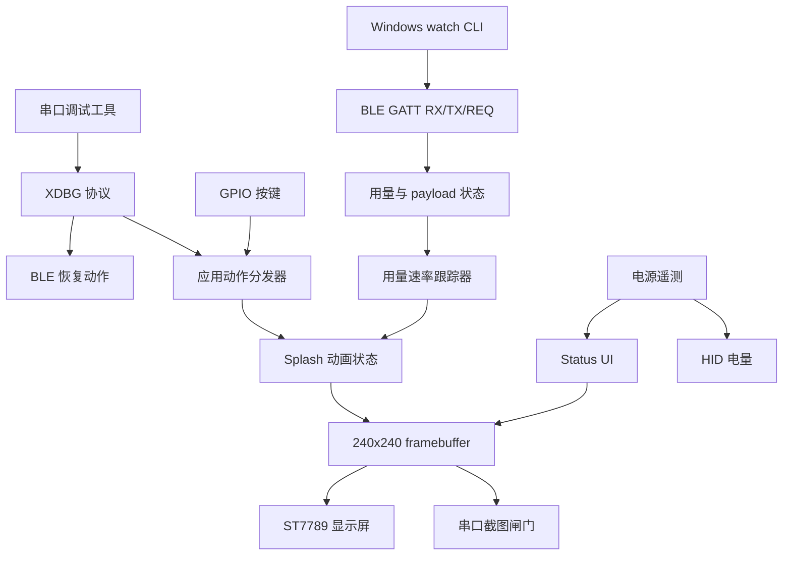
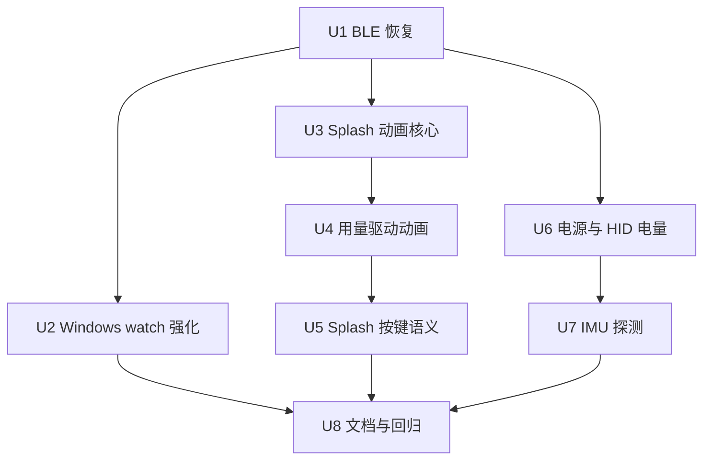

# feat: 继续移植 Xingzhi 原版功能

## 摘要

本计划在现有 `xingzhi_parity` 目标上继续补齐原版 Clawdmeter 的非触摸功能：BLE 恢复、Windows `watch` 长期运行、Clawd splash 动画、用量等级驱动、splash 按键语义、电量/HID 同步和 IMU 可行性探测。实现按阶段交付，每阶段都以串口状态、截图回读、模拟动作或人工验收作为进入下一阶段的闸门。

---

## 问题背景

当前 Xingzhi parity 已经完成显示、串口调试、BLE GATT、HID、三屏 UI 和基础电源遥测，但仍缺少原版日常体验中的蓝牙恢复、长期主机运行、动态 splash 和硬件等价能力。计划必须继续围绕 Xingzhi 的 240x240 ST7789、三颗按键和 Windows 主机路径推进，避免重新引入 Waveshare 的触摸、LVGL 或 PMU 假设。

---

## Requirements / 需求

- R1. 后续移植必须拆成多个阶段，每个阶段只交付一组可独立观察的能力。
- R2. 每个阶段完成后，必须先通过串口状态查询和截图回读验证当前屏幕，再进入下一阶段。
- R3. 交互相关阶段必须通过串口模拟动作或实体按键验证，确认不会破坏已完成的用量显示、BLE 或 HID 行为。
- R4. 每个阶段的 plan 必须写明该阶段的串口验证闸门和人工验收点。
- R5. Xingzhi 必须提供可触发的 BLE 配对清理或恢复路径，替代原版触摸 reset zone。
- R6. BLE 恢复能力必须能通过串口调试触发，并在设备屏幕上显示可理解的恢复状态。
- R7. Windows 主机路径必须从手动一次性发送推进到可长期运行的模式，覆盖发现、连接、重连、发送成功和发送失败。
- R8. Windows 长期运行第一版采用命令行 watch 模式，不要求第一阶段具备 GUI、安装器或开机自启，但必须能产生日常排障所需的清晰日志。
- R9. Xingzhi splash 必须从占位图推进到 Clawd 动画播放体验。
- R10. Splash 动画必须能根据当前用量状态或用量变化选择不同强度/类别的动画。
- R11. Splash 必须支持自动轮换，避免长时间停留在同一动画。
- R12. 实体切换键在 splash 上应优先切换动画；在非 splash 屏幕上继续承担屏幕切换职责。
- R13. 电池和充电显示必须继续校准，至少覆盖 USB 供电、充电中和非充电状态的可观察差异。
- R14. 如果主机侧可见电量状态可用，它应尽量反映设备实际电量，而不是固定值。
- R15. IMU 自动旋转属于候选移植项，但必须先验证 Xingzhi 硬件是否提供可用传感器；不可用时不阻塞其他阶段。
- R16. 已完成的串口 fallback、BLE GATT、HID 快捷键、三屏 UI、截图回读和基础电源遥测必须保持回归可用。
- R17. 新增能力应继续进入 Xingzhi parity 路径，不应把完整功能塞回显示 bring-up 或最小串口仪表目标。
- R18. 默认 Waveshare 原版目标不能因为 Xingzhi 继续移植而被破坏。

**来源参与者:** A1 用户, A2 Codex, A3 Xingzhi 设备, A4 Windows 主机, A5 后续规划/实现者
**来源流程:** F1 分阶段移植与截图闸门, F2 蓝牙恢复与日常连接, F3 原版视觉体验还原
**来源验收示例:** AE1 阶段截图闸门, AE2 BLE 恢复, AE3 Windows watch 重连, AE4 splash 动画变化, AE5 splash/非 splash 按键语义, AE6 电源差异, AE7 回归保护

---

## Scope Boundaries / 范围边界

- 不实现触摸交互，包括触摸切换 splash、触摸关闭 splash 和触摸 reset Bluetooth。
- 不要求本计划完成 Windows GUI、托盘、安装器、服务或开机自启。
- 不把 USB 串口 fallback 作为日常用量传输主路径；它仍是调试和救援路径。
- 不把 `xingzhi_display_bringup` 或 `xingzhi_serial_meter` 扩展成完整功能目标。
- 不为了 Xingzhi 移植重构默认 Waveshare 应用，除非共享逻辑维护确有必要并能回归验证。
- 不手改 `firmware/src/splash_animations.h`，动画资源变更必须走既有生成工具。

### 后续工作延后项

- Windows 托盘、服务、安装器和开机自启：等待命令行 `watch` 模式稳定后单独规划。
- 如果 IMU 探测确认硬件不可用，自动旋转不在本计划继续实现，改为文档化结论或后续硬件方案。
- 原版 480x480 LVGL 视觉完全一致性不作为目标；本计划只做 240x240 Xingzhi 适配后的体验等价。

---

## 上下文与研究

### 相关代码与模式

- `AGENTS.md` 明确要求 Xingzhi 完整功能只进入 `xingzhi_parity`，并要求每段先通过 `status`、`screenshot`、模拟 `button`、BLE 写入或 HID 验证。
- `firmware/src/xingzhi_parity_app.cpp` 已经集中承载显示、串口 fallback、串口调试、BLE、HID、实体按键和电源轮询，是本计划的主集成点。
- `firmware/src/xingzhi_ble.cpp` 已经沿用原版 GATT/HID 模式，但缺少原版 `ble_clear_bonds()` 等价恢复入口，HID battery level 仍固定为 100。
- `firmware/src/xingzhi_debug_serial.cpp` 和 `tools/xingzhi_debug.py` 已有 status、screenshot、button 协议，是新增调试动作和阶段闸门的基础。
- `firmware/src/xingzhi_app_actions.cpp` 已有 screen/HID action dispatcher，但当前 splash 上的 cycle 仍按普通切屏处理，尚未具备“splash 上切动画”的原版语义。
- `firmware/src/xingzhi_meter_ui.cpp` 当前 splash 是静态占位；原版 `firmware/src/splash.cpp`、`firmware/src/splash_animations.h` 和 `firmware/src/usage_rate.cpp` 提供动画、分组、自动轮换和用量等级参考。
- `tools/windows_claude_usage_ble.py` 已有 `--watch`、REQ refresh、ack/nack 和 retry 基础，但还需要把长期运行日志、断线恢复和可测试边界做成第一版日常路径。
- `firmware/src/xingzhi_power.cpp` 已经复用 Xiaozhi 的 GPIO38 + ADC2 channel 6 电量分段；还需要真实状态校准和 HID battery 同步。
- 本地 Xiaozhi 参考 checkout 的 Xingzhi 1.54 WiFi board config 确认了 ST7789 引脚、三颗按键和电源 ADC，但没有发现该板 IMU 配置或驱动引用。

### 既有经验

- 仓库当前没有 `docs/solutions/` 可复用学习文档。
- 之前的 `docs/plans/2026-05-13-003-feat-xingzhi-parity-completion-plan.md` 已证明分段串口闸门适合该硬件迁移路径；本计划延续同一执行姿态。

### 外部参考

- 未进行新的外部研究；现有 repo 已包含原版实现和当前 Xingzhi parity 模式，足以支撑本阶段计划。

---

## 关键技术决策

- 继续扩展 `xingzhi_parity`：当前目标已经是完整功能承载点，新建目标会分散串口调试、BLE、HID 和 UI 状态。
- BLE 恢复先走串口和 status 屏：这能替代原版触摸 reset zone，也能被 Codex 验证，不依赖用户在屏幕上触摸不可用区域。
- Windows 长期运行先做 CLI `watch`：它最小化安装成本，同时覆盖发现、连接、重连、ack 和日志，是托盘/服务前的稳定性基线。
- 动画复用原版生成资源但重写渲染路径：Xingzhi 使用 Arduino_GFX/240x240 framebuffer，不引入 LVGL；`splash_animations.h` 保持生成文件。
- 用量等级只由有效 payload 推进：invalid/error payload 可以更新错误显示，但不改变 splash 动画等级，避免错误状态误驱动视觉情绪。
- Splash 上的 cycle 优先切动画，同时提供非触摸退出方式：原版靠触摸退出 splash；Xingzhi 需要用按键或串口动作保留可退出路径。
- 电量以真实可验证读数为准：HID battery level 只有在电源状态 valid 时同步，校准不足时不输出伪准确状态。
- IMU 先探测再实现：本地 Xiaozhi 参考源码没有 Xingzhi 1.54 WiFi 的 IMU 证据，自动旋转不能作为无条件实现项。

---

## 开放问题

### 计划阶段已解决

- BLE 恢复入口：第一版走串口调试命令和 status 屏状态表达，后续可以再考虑实体按键快捷入口。
- Windows 长期运行形态：用户选择命令行 `watch` 模式，后台任务、托盘或服务后置。
- 动画技术路线：复用原版动画数据和分组意图，但使用 Xingzhi 专用 Arduino_GFX 渲染模块，不复用 LVGL splash。
- IMU 处理：先做可行性探测和文档化；未发现硬件时不阻塞其他阶段。

### 留给实现阶段

- BLE 清 bond 后 Windows 侧缓存是否需要额外人工删除：需要在真实 Windows 配对状态下观察。
- Clawd 动画在 240x240 上的最终缩放、居中和帧率：需要实体截图回读确认。
- 电池 ADC 分段是否需要为用户这台设备微调：需要 USB、充电和非充电状态的多次采样。
- 如果 IMU 探测发现候选地址，是否值得进入自动旋转实现：取决于真实读数稳定性和屏幕方向需求。

---

## 高层技术设计

> *下图用于说明计划中的实现方向，是供评审理解的方向性指导，不是实现规格。执行实现的 agent 应把它当作上下文，而不是要逐字复现的代码。*

---

## 分阶段交付

### 阶段 1: BLE 恢复闸门

- U1 先补齐 BLE 清配对/恢复命令、状态表达和串口验证。

### 阶段 2: Windows 日常运行闸门

- U2 强化 `watch` 模式、重连日志和可测试失败路径。

### 阶段 3: Splash 动画闸门

- U3 添加 240x240 Clawd 动画渲染核心。
- U4 接入用量等级、自动轮换和 debug 可观察状态。
- U5 调整 splash 上的按键语义并提供非触摸退出路径。

### 阶段 4: 电源与硬件等价闸门

- U6 校准电源状态并同步 HID battery。
- U7 探测 IMU 可用性，决定是否仅文档化或进入后续实现。

### 阶段 5: 文档与回归闸门

- U8 更新使用文档、验收记录和回归矩阵。

---

## Implementation Units / 实现单元

### U1. BLE 恢复入口

**目标:** 为 Xingzhi parity 增加可串口触发、可状态查询、可截图确认的 BLE 配对清理/恢复路径，替代原版触摸 reset zone。

**需求:** R1, R2, R3, R5, R6, R16, R17, R18; 覆盖 F1, F2, AE1, AE2, AE7

**依赖:** 无

**文件:**
- 修改: `firmware/src/xingzhi_ble.h`
- 修改: `firmware/src/xingzhi_ble.cpp`
- 修改: `firmware/src/xingzhi_debug_serial.h`
- 修改: `firmware/src/xingzhi_debug_serial.cpp`
- 修改: `firmware/src/xingzhi_parity_app.cpp`
- 修改: `firmware/src/xingzhi_meter_ui.h`
- 修改: `firmware/src/xingzhi_meter_ui.cpp`
- 修改: `firmware/test/test_xingzhi_debug_protocol/test_main.cpp`
- 修改: `tools/xingzhi_debug.py`
- 修改: `tools/tests/test_xingzhi_debug.py`

**做法:**
- 暴露 Xingzhi 专用 BLE 恢复操作，复刻原版清 bond 和重新广播行为，但不修改 `firmware/src/ble.cpp`。
- 扩展调试协议，加入可由 `tools/xingzhi_debug.py` 调用的 BLE 恢复动作。
- 在状态输出和 status 屏记录恢复结果、最近 BLE 错误、广播状态和恢复提示。
- 保持既有 status、screenshot、button 命令和串口 JSON fallback 兼容。

**参考模式:**
- 原版 `firmware/src/ble.cpp` 的 `ble_clear_bonds()` 行为。
- `firmware/src/xingzhi_debug_serial.cpp` 中现有 `XDBG STATUS`、`XDBG ERROR` 和 button 解析风格。
- `tools/xingzhi_debug.py` 中现有排序 key-value 输出风格。

**测试场景:**
- 正常路径: 解析 BLE 恢复命令时得到新的调试命令类型，且既有命令保持不变。
- 正常路径: 主机工具发出正确的恢复命令，并打印返回的 status/action 字段。
- 边界情况: 未知 BLE 恢复子命令返回可解析的调试错误，且不改变 payload 状态。
- 集成: 在硬件上触发恢复后，status 报告可恢复的 BLE 状态，截图显示 status 屏恢复结果。
- 回归: 新增命令后，status、screenshot、button 模拟和串口 JSON fallback 仍可工作。

**验证:**
- Native 固件调试协议测试覆盖新命令和既有命令兼容性。
- Python 调试工具测试覆盖命令发送和响应解析。
- 硬件闸门: 通过串口触发 BLE 恢复，确认 status 显示恢复结果，捕获 status 截图，然后验证 BLE 广播/连接可重新建立。

---

### U2. Windows watch 长期运行强化

**目标:** 把 Windows BLE 工具的 `watch` 模式提升为第一版日常长期运行路径，覆盖发现、连接、重连、发送、ack/nack、REQ refresh 和日志可排障性。

**需求:** R1, R2, R7, R8, R16; 覆盖 F1, F2, AE1, AE3, AE7

**依赖:** U1

**文件:**
- 修改: `tools/windows_claude_usage_ble.py`
- 修改: `tools/tests/test_windows_claude_usage_ble.py`
- 修改: `docs/xingzhi-parity.md`

**做法:**
- 第一版长期运行模式保持为 CLI `watch`，不加入托盘、服务、计划任务或安装器。
- 明确扫描失败、连接失败、写入失败、ack 超时、nack、Claude 轮询失败和断开回调的重试行为。
- 明确 `watch` 模式下 nack 或必需 ack 超时不能结束长期进程；应记录失败、断开当前会话，并按 `retry_delay` 重新发现、连接和发送。
- 改善日志，让用户能区分“找不到设备”、“已配对但缓存陈旧”、“payload 被拒绝”和“网络/凭据失败”。
- 保留测试 preset 模式，使长期 BLE 行为可以不访问 Claude API 就完成测试。
- 保持直接一次性发送和 dry-run 模式可用。

**参考模式:**
- `tools/windows_claude_usage_ble.py` 中现有 async session/retry 分层。
- `tools/tests/test_windows_claude_usage_ble.py` 中现有 fake scanner/client 测试。

**测试场景:**
- 正常路径: watch 模式写入多个 payload，处理 REQ refresh，并只在配置的测试上限达到时退出。
- 错误路径: watch 中扫描失败时记录错误并重试，而不是直接退出。
- 错误路径: 连接中断时记录断开并进入重试循环。
- 错误路径: nack 或必需 ack 超时在日志中可见，一次性发送模式返回失败。
- 错误路径: watch 中 nack 或必需 ack 超时记录失败并重试，而不是返回进程失败。
- 边界情况: watch 中 Claude 轮询失败时记录轮询失败并重试，同时不丢失 BLE 重试行为。
- 回归: `--dry-run`、`--test-preset`、地址选择、service 优先选择和缺失 Bleak 错误保持不变。

**验证:**
- Python 测试覆盖 watch 重试行为和既有一次性发送行为。
- 硬件闸门: 使用测试 preset 运行 watch，观察至少两次成功写入，捕获显示 `source=ble` 的设备状态，然后模拟断开/重连并确认日志显示恢复过程。

---

### U3. 240x240 Clawd 动画渲染核心

**目标:** 把 Xingzhi splash 从静态占位推进到可播放 Clawd 动画的 240x240 framebuffer 渲染体验。

**需求:** R1, R2, R9, R11, R16, R17, R18; 覆盖 F1, F3, AE1, AE4, AE7

**依赖:** U1

**文件:**
- 新增: `firmware/src/xingzhi_splash_anim.h`
- 新增: `firmware/src/xingzhi_splash_anim.cpp`
- 修改: `firmware/src/xingzhi_meter_ui.h`
- 修改: `firmware/src/xingzhi_meter_ui.cpp`
- 修改: `firmware/src/xingzhi_parity_app.cpp`
- 修改: `firmware/platformio.ini`
- 新增: `firmware/test/test_xingzhi_splash_anim/test_main.cpp`

**做法:**
- 新增 Xingzhi 专用动画状态模块，读取生成的动画 catalog 数据，但通过 Arduino_GFX 兼容绘制路径渲染，不使用 LVGL。
- 将动画 catalog/状态推进与显示适配器分离，使 native 测试无需依赖 Arduino_GFX 也能验证选择和计时。
- 将原版 20x20 sprite 网格缩放到 240x240 显示屏，并确保结果可通过现有 framebuffer 截图路径观察。
- 让动画帧推进独立于用量 payload 解析，使截图测试不需要 BLE 也能观察帧变化。
- 在 debug status 中暴露轻量动画元数据，使 frame/name/group 变化即使截图很相似也可验证。
- 不直接修改 `firmware/src/splash_animations.h`。

**参考模式:**
- 原版 `firmware/src/splash.cpp` 的动画 catalog、帧停留时间和 fallback 行为。
- `firmware/src/xingzhi_meter_ui.cpp` 中现有 `draw_splash_screen` 绘制入口。
- `firmware/test/test_xingzhi_app_actions/test_main.cpp` 中现有 native 测试风格。

**测试场景:**
- 正常路径: 动画状态从有效帧开始，并在帧停留时间结束后推进。
- 正常路径: 绘制一帧会产生非空 splash 状态，且不需要有效用量数据。
- 边界情况: 动画 catalog 为空或不可用时回退到稳定占位状态。
- 错误路径: 无效动画索引被 clamp 或拒绝，且不破坏当前屏幕状态。
- 回归: 扩展 splash 状态后，usage 和 status 屏渲染路径仍可调用。

**验证:**
- Native 动画测试覆盖帧推进和 fallback 行为。
- 硬件闸门: 切换到 splash，分别在帧推进前后捕获截图，并确认 status 报告动画元数据。

---

### U4. 用量等级驱动动画

**目标:** 将原版用量增长速率分组和 splash 自动轮换迁移到 Xingzhi，使有效用量 payload 能影响动画类别，错误 payload 不误驱动动画。

**需求:** R1, R2, R9, R10, R11, R16, R17, R18; 覆盖 F1, F3, AE1, AE4, AE7

**依赖:** U3

**文件:**
- 修改: `firmware/src/usage_rate.cpp`
- 修改: `firmware/src/usage_rate.h`
- 修改: `firmware/src/xingzhi_splash_anim.h`
- 修改: `firmware/src/xingzhi_splash_anim.cpp`
- 修改: `firmware/src/xingzhi_parity_app.cpp`
- 修改: `firmware/src/xingzhi_debug_serial.h`
- 修改: `firmware/src/xingzhi_debug_serial.cpp`
- 修改: `firmware/platformio.ini`
- 新增: `firmware/test/test_usage_rate/test_main.cpp`
- 修改: `firmware/test/test_xingzhi_debug_protocol/test_main.cpp`

**做法:**
- 将 `usage_rate` 加入 Xingzhi parity 构建和 native 测试构建。
- 通过隔离时间来源或提供非 Arduino 测试 seam，使用量速率跟踪器可做 native 测试；不要让直接 `millis()` 依赖阻塞单元覆盖。
- 只在 payload 解析为有效用量数据时采样速率跟踪器。
- 将得到的速率分组映射到原版 splash 系统相同的大类动画情绪，并按 `splash_animations.h` 中可用动画调整。
- 当 splash 处于激活状态时自动轮换，并通过 debug 元数据暴露当前分组和选中动画。
- 保留 invalid/error payload 的显示语义，不改变当前动画分组。

**参考模式:**
- 原版 `firmware/src/usage_rate.cpp` 的阈值和 reset 行为。
- 原版 `firmware/src/splash.cpp` 的分组选择和轮换意图。
- `firmware/src/xingzhi_parity_app.cpp` 中现有 `payload_state` 处理。

**测试场景:**
- 正常路径: 稳定增长的有效 session 百分比最终产生非 idle 分组。
- 正常路径: session 百分比下降会重置速率跟踪，而不是产生错误的 heavy 分组。
- 边界情况: 样本窗口不足时报告 idle/warm-up 分组。
- 错误路径: invalid JSON 和 error payload 不采样用量速率。
- 集成: 当 splash 激活时，有效 BLE payload 改变速率分组后，动画元数据发生变化且截图仍可读。

**验证:**
- Native 测试覆盖速率分组阈值、reset 和 warm-up 行为。
- 硬件闸门: 发送受控有效 payload，切换到 splash，自动轮换前后捕获截图/status，然后发送 invalid payload 并确认分组不变。

---

### U5. Splash 按键语义与非触摸退出

**目标:** 让实体切换键在 splash 上优先切换动画，同时提供不依赖触摸的退出方式，避免 Xingzhi 在 splash 中失去导航能力。

**需求:** R1, R2, R3, R12, R16, R17, R18; 覆盖 F1, F3, AE1, AE5, AE7

**依赖:** U4

**文件:**
- 修改: `firmware/src/xingzhi_app_actions.h`
- 修改: `firmware/src/xingzhi_app_actions.cpp`
- 修改: `firmware/src/xingzhi_buttons.h`
- 修改: `firmware/src/xingzhi_buttons.cpp`
- 修改: `firmware/src/xingzhi_debug_serial.h`
- 修改: `firmware/src/xingzhi_debug_serial.cpp`
- 修改: `firmware/src/xingzhi_parity_app.cpp`
- 修改: `firmware/test/test_xingzhi_app_actions/test_main.cpp`
- 修改: `firmware/test/test_xingzhi_debug_protocol/test_main.cpp`
- 修改: `tools/xingzhi_debug.py`
- 修改: `tools/tests/test_xingzhi_debug.py`

**做法:**
- 扩展动作模型，使“在 splash 上 cycle”可解释为“下一段动画”，而不是“下一屏”。
- 增加从 splash 回到上一个非 splash 屏幕的非触摸退出路径，优先使用长按或明确 debug action，使普通 click 保持为切换动画。
- 让实体按键处理能发出所需事件，同时不扰乱现有 HID press/release 行为。
- 通过 debug action 输出、status 元数据和截图状态让新行为可观察。

**参考模式:**
- 原版 `firmware/src/main.cpp` 中间键在 splash 上切换动画的行为。
- 现有 action dispatcher 测试中屏幕导航和 HID 行为分离的模式。

**测试场景:**
- 正常路径: 从 usage 执行 cycle click 进入 status；从 status 执行 cycle click 进入 splash。
- 正常路径: 从 splash 执行 cycle click 推进动画，并停留在 splash。
- 正常路径: 从 splash 执行选定的非触摸退出动作，返回上一个非 splash 屏幕。
- 边界情况: 扩展动作模型后，HID press/release 状态仍保持平衡。
- 错误路径: 无效 debug action/event 返回错误，且不改变屏幕或动画状态。
- 集成: 串口模拟动作和实体按键路径产生相同的应用行为。

**验证:**
- Native action 和调试协议测试覆盖 splash 专用行为。
- 硬件闸门: 使用串口模拟进入 splash、切换动画、退出 splash，并为每个状态捕获截图；人工验证实体按键与模拟行为一致。

---

### U6. 电源校准与 HID battery 同步

**目标:** 让电源状态在真实硬件上更可信，并在可用时把实际电量同步给 BLE HID，而不是继续固定为 100。

**需求:** R1, R2, R13, R14, R16, R17, R18; 覆盖 F1, AE1, AE6, AE7

**依赖:** U1

**文件:**
- 修改: `firmware/src/xingzhi_power.h`
- 修改: `firmware/src/xingzhi_power.cpp`
- 修改: `firmware/src/xingzhi_ble.h`
- 修改: `firmware/src/xingzhi_ble.cpp`
- 修改: `firmware/src/xingzhi_parity_app.cpp`
- 修改: `firmware/src/xingzhi_meter_ui.cpp`
- 修改: `firmware/test/test_xingzhi_power/test_main.cpp`

**做法:**
- 保留 Xiaozhi 来源的 ADC 分段作为初始校准基线，但让 valid/sampling/error 状态足够明确，避免虚假的精确感。
- 只在 power status 为 valid 时更新 HID battery level；sampling/unavailable 时保留保守值或上一次已知状态。
- 显示足够状态细节，以区分 USB 供电充电、电池/放电、sampling 和 error 状态。
- 修改校准分段前，先把硬件观察结果记录到文档。

**参考模式:**
- Xiaozhi `power_manager.h` 的 ADC 分段和充电引脚行为。
- 现有 `xingzhi_power_record_sample` native 测试 seam。
- 现有 status 屏 key/value 布局。

**测试场景:**
- 正常路径: 三个有效 ADC 样本产生有效平均电量，并生成可同步到 HID 的电量值。
- 正常路径: charging 标志变化会反映到 status 输出中。
- 边界情况: sampling 状态不会把误导性的电量当作最终值发布。
- 错误路径: 无效 ADC 样本报告 error，且不更新 HID battery。
- 回归: 既有电量插值测试继续通过。

**验证:**
- Native power 测试覆盖 valid、sampling、charging 和无效样本行为。
- 硬件闸门: 在 USB 供电下捕获 status 和截图；如条件允许，在非充电或电池状态下重复，并记录观察到的差异。

---

### U7. IMU 可行性探测

**目标:** 验证 Xingzhi 1.54 WiFi 是否存在可用 IMU；只有发现稳定硬件证据时，才进入自动旋转实现，否则记录为不适用。

**需求:** R1, R2, R15, R16, R17, R18; 覆盖 F1, AE1, AE7

**依赖:** U6

**文件:**
- 修改: `firmware/src/xingzhi_debug_serial.h`
- 修改: `firmware/src/xingzhi_debug_serial.cpp`
- 修改: `firmware/src/xingzhi_parity_app.cpp`
- 修改: `firmware/test/test_xingzhi_debug_protocol/test_main.cpp`
- 修改: `tools/xingzhi_debug.py`
- 修改: `tools/tests/test_xingzhi_debug.py`
- 修改: `docs/xingzhi-parity.md`
- 修改: `docs/brainstorms/2026-05-14-xingzhi-original-parity-phase2-requirements.md`，仅当探测结果需要收窄需求假设时

**做法:**
- 增加轻量硬件探测路径，用于报告是否能看到预期的 IMU 类设备，但不把自动旋转变成必做项。
- 将探测结果与本地 Xiaozhi board 参考对比；当前参考未列出该板的 IMU 支持。
- 如果未检测到受支持 IMU，则把自动旋转记录为该硬件不适用，并保持计划不被阻塞。
- 如果检测到受支持 IMU，则先停在证据捕获阶段，再为旋转实现创建后续计划或计划修订。

**参考模式:**
- 原版 `firmware/src/imu.cpp` 只作为行为参考，不作为无条件编译进 Xingzhi 的代码。
- 现有 debug 命令/主机工具模式，用于输出可解析硬件状态。

**测试场景:**
- 正常路径: 固件 debug parser 能识别 probe 命令并格式化稳定结果。
- 正常路径: debug 工具能解析并显示 probe 结果。
- 边界情况: 未检测到 IMU 时返回稳定的“not available”结果，而不是阻塞固件的错误。
- 错误路径: probe 失败报告为 debug error 或 unavailable 状态，且不影响显示、BLE、HID 或电源。
- 回归: 加入 probe 支持后，screenshot、status、button、BLE recovery 和串口 fallback 仍可用。

**验证:**
- Python debug 工具测试覆盖 probe 响应解析。
- 硬件闸门: 运行 probe，捕获 status 和截图，并记录 IMU 是不可用还是需要后续实现计划。

---

### U8. 文档、验收记录与回归矩阵

**目标:** 更新用户操作文档和阶段验收记录，使后续 `ce-work` 或人工继续执行时能按同一闸门推进。

**需求:** R1, R2, R3, R4, R16, R17, R18; 覆盖 F1, AE1, AE7

**依赖:** U1, U2, U3, U4, U5, U6, U7

**文件:**
- 修改: `docs/xingzhi-parity.md`
- 修改: `docs/xingzhi-serial-debug.md`
- 修改: `AGENTS.md`，仅当贡献者指南需要新增重复闸门时
- 修改: `README.md`，仅当面向用户的 Xingzhi 状态发生实质变化时

**做法:**
- 为 BLE 恢复、Windows watch、splash 动画、用量驱动动画、splash 按键行为、电源/HID 电量和 IMU probe 添加分阶段验证闸门。
- 在人工验收完成时，用具体日期记录已知硬件观察结果。
- Windows 操作文档聚焦 CLI `watch`，GUI/service 说明后置。
- 保留 `xingzhi_display_bringup`、`xingzhi_serial_meter` 和 `xingzhi_parity` 的职责区分。

**参考模式:**
- 现有 `docs/xingzhi-parity.md` U1-U7 闸门格式。
- AGENTS 中关于串口闸门和目标隔离的现有指导。

**测试场景:**
- 测试预期: 无 -- 这是纯文档单元，通过文档 review 以及检查每个实现单元都有文档化闸门来验证。

**验证:**
- 文档包含清晰的分阶段 checklist。
- 最终回归预期列出主机测试、native 固件测试、parity 构建、默认 Waveshare 构建和硬件闸门，且不嵌入机器专属密钥或路径。

---

## 系统影响

- **交互图:** BLE recovery、debug serial、status UI、Windows watch、splash 动画、action dispatcher、电源遥测和 HID 电量现在都通过 parity app 状态交互。变更应避免出现 `XDBG STATUS` 不可见的隐藏状态突变。
- **错误传播:** 固件侧 BLE 和硬件错误应通过 `XDBG STATUS`、status 屏和主机日志暴露，同时不破坏最近一次有效用量 payload。
- **状态生命周期风险:** BLE recovery 可能断开主机；watch 模式必须把它视为预期内可恢复状态。Splash 动画状态不能重置用量数据。电源 sampling 不能发布虚假的 valid 电量。
- **API 表面一致性:** 现有串口 JSON fallback、`status`、`screenshot`、`button`、BLE RX/TX/REQ 和 HID key report 仍是测试和用户工作流的公开表面。
- **集成覆盖:** 单元测试覆盖解析器/状态机；BLE 配对、截图视觉状态、实体按键、电源读数和任何 IMU 结果都需要硬件闸门。
- **不变约束:** 默认 Waveshare 构建保持为原版目标，`xingzhi_display_bringup`/`xingzhi_serial_meter` 仍保持窄验证目标。

---

## 风险分析与缓解

| 风险 | 可能性 | 影响 | 缓解措施 |
|------|------------|--------|------------|
| BLE bond 清理在 Windows 缓存状态下行为不同 | 中 | 高 | 让恢复动作可由串口触发，记录恢复前后状态，并用真实 Windows 配对验证。 |
| Watch 模式用重试掩盖重复失败 | 中 | 中 | 要求 scan/connect/write/ack/poll 失败类别有清晰日志，并为重试路径添加测试。 |
| 动画数据增加 flash/RAM 压力 | 中 | 高 | 复用生成的紧凑帧数据，避免 LVGL，并在硬件闸门前让动画模块可独立测试。 |
| Splash click 语义让导航变混乱 | 中 | 中 | 保留非触摸退出路径，并验证串口模拟和实体按键行为。 |
| 电池校准看似精确但实际与设备个体相关 | 中 | 中 | 明确 sampling/valid/error 状态，并在修改分段前记录观察到的硬件状态。 |
| IMU 工作变成开放式探索 | 高 | 中 | 除非确认硬件支持，否则本计划只限于 probe/证据捕获。 |
| 既有已验证路径回归 | 中 | 高 | 每一阶段都包含串口截图/status 闸门和最终主机/native/构建/硬件回归预期。 |

---

## 文档与运维说明

- `docs/xingzhi-parity.md` 应继续作为面向用户的 Xingzhi parity 主工作流和验证记录。
- `docs/xingzhi-serial-debug.md` 应记录任何新增 debug 命令和预期可解析字段。
- Windows 文档应优先强调 CLI `watch`，并明确后置托盘/service/自启动。
- 不记录本地 BLE MAC 缓存、凭据、原始截图 dump 或机器专属路径。

---

## 来源与参考

- **来源文档:** `docs/brainstorms/2026-05-14-xingzhi-original-parity-phase2-requirements.md`
- 既有 parity 计划: `docs/plans/2026-05-13-003-feat-xingzhi-parity-completion-plan.md`
- 当前 parity 文档: `docs/xingzhi-parity.md`, `docs/xingzhi-serial-debug.md`
- 当前 Xingzhi 固件: `firmware/src/xingzhi_parity_app.cpp`, `firmware/src/xingzhi_ble.cpp`, `firmware/src/xingzhi_meter_ui.cpp`, `firmware/src/xingzhi_app_actions.cpp`, `firmware/src/xingzhi_power.cpp`
- 原版参考固件: `firmware/src/ble.cpp`, `firmware/src/splash.cpp`, `firmware/src/usage_rate.cpp`, `firmware/src/imu.cpp`
- 主机工具: `tools/windows_claude_usage_ble.py`, `tools/xingzhi_debug.py`
- Xiaozhi 本地参考: 本地 Xingzhi 1.54 WiFi board config 和 power manager checkout，仅作为硬件参考，不作为本计划的目标仓库。
