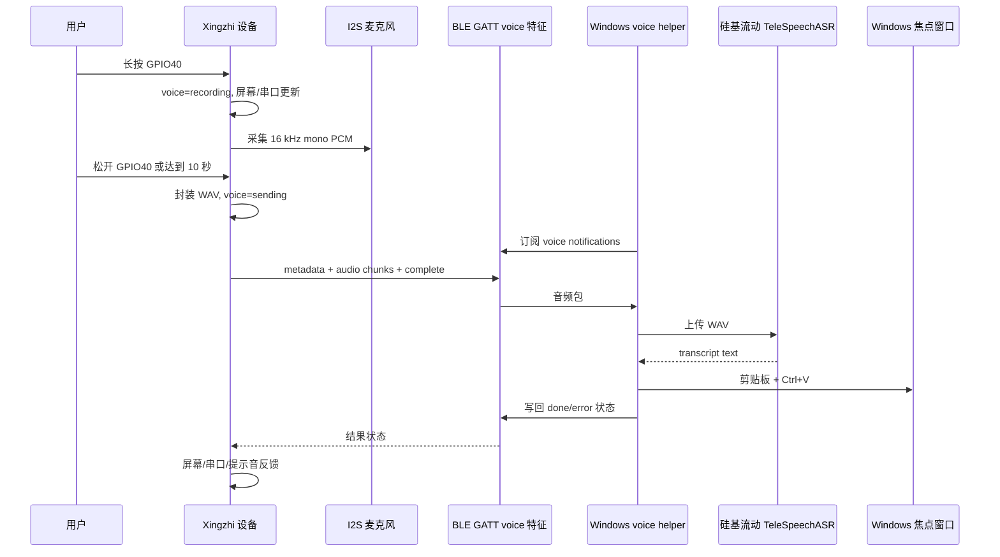
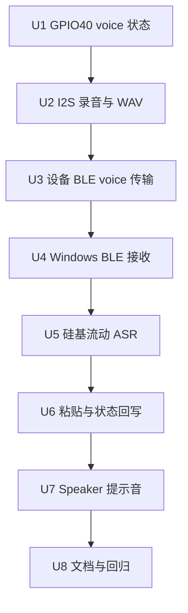

# feat: 添加 Xingzhi BLE 语音听写输入

## Summary

本计划在 `xingzhi_parity` 上新增 GPIO40 长按语音听写链路：设备负责按键状态、I2S 麦克风录音、BLE 音频上传和屏幕/串口/提示音反馈；Windows 端新增语音 helper，负责接收音频、调用硅基流动 ASR，并把识别结果粘贴到当前焦点窗口。交付按串口闸门拆段推进，每一段都先用 `status`、`screenshot`、模拟按键、BLE 接收或人工焦点窗口验证通过后再进入下一段。

---

## Problem Frame

当前 GPIO40 是 BLE HID Space 键，适合快捷键输入，但不能把设备麦克风语音转成 Windows 当前焦点窗口里的文本。新能力跨固件按键、I2S 音频、BLE GATT、Windows BLE、硅基流动 ASR API 和本机输入模拟，必须避免一次性大改导致无法定位硬件、链路或主机侧问题。

---

## Requirements

- R1. GPIO40 在第一版中改为专用语音输入键，不再发送 HID Space。
- R2. GPIO40 短按必须被忽略；长按达到阈值后开始录音，松开后结束录音并上传。
- R3. 单次录音最长 10 秒，到达上限后自动停止并进入上传或可恢复错误状态。
- R4. 设备必须从 Xingzhi 板载 I2S 麦克风采集音频，引脚配置基于本地 `xiaozhi-esp32` 的 Xingzhi board 配置。
- R5. 音频主链路使用 BLE GATT，采用松开后一次性上传，不使用 USB 串口、Wi-Fi 或实时流式 ASR。
- R6. 屏幕和串口状态至少覆盖 idle、recording、sending、recognizing、done、error。
- R7. Windows helper 必须接收 BLE 音频并调用硅基流动语音识别，模型固定为 `TeleAI/TeleSpeechASR`。
- R8. 硅基流动 API key 只从本地 `.env` 读取，变量名使用 `SILICONFLOW_API_KEY`；`.env` 必须被 `.gitignore` 覆盖，日志不得打印密钥。
- R9. 成功识别后通过剪贴板加 Ctrl+V 输入到当前 Windows 焦点窗口；失败时不得粘贴错误内容。
- R10. 设备需要简单提示音覆盖开始录音、停止/上传、成功、失败。
- R11. 每个实现阶段必须先通过串口调试状态、截图或模拟动作验证后再继续。
- R12. GPIO0、GPIO39、usage BLE、serial fallback、三屏 UI、splash、电量和 HID battery 既有行为必须保持回归可用。

**Origin actors:** A1 用户, A2 Xingzhi 设备, A3 Windows helper, A4 硅基流动 ASR 服务
**Origin flows:** F1 长按录音, F2 松开后 BLE 上传, F3 Windows ASR 后粘贴, F4 设备/串口错误状态, F5 短按忽略
**Origin acceptance examples:** AE1 短句听写成功, AE2 短按忽略, AE3 10 秒上限, AE4 `.env` 缺失失败, AE5 BLE/ASR 失败恢复, AE6 每阶段串口截图闸门

---

## Scope Boundaries

- 不做实时语音流式识别。
- 不使用电脑麦克风作为默认音频来源。
- 不保留 GPIO40 的 Space 兼容行为。
- 不接入 OpenAI、Azure、Whisper 本地模型或其他 ASR provider。
- 不做 Windows 托盘、服务、安装器或开机自启。
- 不支持超过 10 秒的长段录音。
- 不实现触摸交互或额外 UI 页面。
- 不把语音音频塞进现有 usage JSON RX characteristic。
- 不在测试或日志中保存硅基流动 API key、完整隐私音频或转写内容，除非用户显式要求调试输出。

### Deferred to Follow-Up Work

- Windows 托盘、服务化安装、开机自启：语音 CLI helper 稳定后单独规划。
- 实时 ASR、边说边出字、端侧 VAD：第一版 push-to-talk 完成后再评估。
- 语音命令、快捷键解析或自动执行操作：本计划只做听写文本输入。
- 高级音频编码如 Opus：第一版先用可调试的 WAV/PCM 链路打通。

---

## Context & Research

### Relevant Code and Patterns

- `AGENTS.md` 要求 Xingzhi 完整功能进入 `xingzhi_parity`，并要求每个实现段先通过串口 `status`、`screenshot`、模拟 `button`、BLE 或 probe 闸门验证。
- `firmware/src/xingzhi_buttons.cpp` 当前把 GPIO40 映射到 `XingzhiAction::HidSpace`，且只有 `CycleScreen` 启用 long press。
- `firmware/src/xingzhi_app_actions.h` 和 `firmware/src/xingzhi_app_actions.cpp` 是实体按键、串口模拟动作和 HID 行为的共享 action dispatcher。
- `firmware/src/xingzhi_parity_app.cpp` 集成串口调试、BLE payload、HID、三屏 UI、电源轮询和 splash tick，是语音状态机的主集成点。
- `firmware/src/xingzhi_ble.cpp` 已提供 NimBLE peripheral、自定义 GATT service、TX/REQ notify、HID keyboard 和 battery service；语音应复用配对/连接，但隔离出 voice 专用特征。
- `firmware/src/xingzhi_debug_serial.cpp`、`tools/xingzhi_debug.py` 和对应测试已经建立 key-value 状态行、截图回读、button、BLE、probe 的调试模式。
- `tools/windows_claude_usage_ble.py` 已有 Windows BLE 扫描、配对地址 fallback、watch、ack/nack 和 fake client 测试，可复用发现/连接思路。
- 本地 `xiaozhi-esp32` 参考 checkout 的 Xingzhi 1.54 WiFi board 配置给出麦克风引脚：WS=GPIO4、SCK=GPIO5、DIN=GPIO6；speaker 引脚为 DOUT=GPIO7、BCLK=GPIO15、LRCK=GPIO16。
- 本地 `xiaozhi-esp32` 参考 checkout 的 no-audio codec 使用 ESP-IDF I2S std channel 从 32-bit 样本转换为 int16 PCM，可作为 I2S 采集方向参考。
- `firmware/platformio.ini` 的 `xingzhi_parity` 当前未显式加入音频源码，后续需要把新增 `xingzhi_voice_*` 文件加入该环境和 native 测试环境。
- `.gitignore` 当前没有 `.env`，需要在引入硅基流动 key 前补齐。

### Institutional Learnings

- `docs/solutions/ui-bugs/xingzhi-st7789-display-inversion-white-background-2026-05-14.md` 说明串口截图只证明 framebuffer 状态，实体屏输出仍需人工确认。语音 UI 阶段同样应同时看串口截图和实体屏/听觉反馈。

### External References

- 硅基流动语音转文本 API：`POST https://api.siliconflow.cn/v1/audio/transcriptions`，认证使用 `Authorization: Bearer <YOUR_API_KEY>`，body 为 `multipart/form-data`，必填 `file` 和 `model`；文件限制为时长不超过 1 小时、大小不超过 50MB；可选模型包含 `TeleAI/TeleSpeechASR`；响应返回包含 `text` 的 JSON。<https://docs.siliconflow.cn/cn/api-reference/audio/create-audio-transcriptions>

---

## Key Technical Decisions

- 继续只扩展 `xingzhi_parity`：显示 bring-up 和 serial meter 仍保持最小目标，避免把完整功能分散到多个固件入口。
- GPIO40 新增 voice action，而不是复用 `HidSpace`：这能让短按忽略、长按录音、松开上传成为独立语义，并消除误发 Space 的风险。
- 修改 debounce 支持“长按后仍上报 release”：现有 `CycleScreen` 长按会抑制 release；voice 需要 long press 开始录音、release 结束录音，因此要把 release-after-long 变成 action 级策略。
- 音频第一版使用 16 kHz mono PCM 并封装为 WAV：它和 Xiaozhi board 配置一致，10 秒音频远低于硅基流动转写接口的 1 小时/50MB 限制；不先引入 Opus/ADPCM，优先可调试性。
- 录音缓冲优先使用 PSRAM，并通过串口 probe 暴露容量：10 秒 16 kHz int16 PCM 约 320 KB，必须在实机上确认可分配，失败时进入可恢复错误而不是崩溃。
- Voice GATT 使用现有自定义 service 下的独立 voice 特征：复用当前配对、扫描和单连接路径，但 usage RX/TX/REQ 语义保持不变，避免音频 chunk 被 usage parser 消费。
- Windows 端新增独立 `tools/windows_xingzhi_voice_dictation.py`：不把语音接收、硅基流动 ASR 和粘贴逻辑塞进 usage helper；BLE 发现/配对地址 fallback 可提取为共享 helper。
- ASR 默认 provider 使用硅基流动，模型固定为 `TeleAI/TeleSpeechASR`：请求使用兼容 `multipart/form-data` 的轻量 wrapper，单元测试不访问网络；后续如需多 provider 再单独扩展。
- `.env` 解析使用本地文件和环境变量组合：优先本地 `.env`/环境变量，缺失时明确失败；不强依赖 `python-dotenv`。
- 粘贴实现采用适配层：Windows 剪贴板写入和 Ctrl+V 发送封装在可替换 adapter 中，单元测试使用 fake adapter；真实实现优先使用 Windows 原生 API，减少额外依赖。
- 剪贴板恢复采用 best-effort：识别文本必须可靠粘贴；如果能读取旧文本剪贴板，则粘贴后尝试恢复，恢复失败不回滚已输入文本。
- Speaker 提示音作为独立验收阶段：主语音链路先用屏幕和串口验证闭环，speaker I2S 输出在后续单元单独接入，避免音频输入输出同时 bring-up 时难以定位。

---

## Open Questions

### Resolved During Planning

- 音频编码：第一版选 WAV/PCM，不引入压缩编码。
- BLE service 策略：复用现有自定义 service，但新增 voice 专用特征，隔离 usage payload。
- 硅基流动 API 调用：Windows helper 调用 `audio/transcriptions`，使用 `TeleAI/TeleSpeechASR`，不使用实时流式 ASR。
- 剪贴板策略：可靠粘贴优先，旧剪贴板文本 best-effort 恢复。
- Speaker 反馈：纳入计划，但放在主链路之后单独闸门验收。

### Deferred to Implementation

- BLE chunk 大小和 MTU：根据 NimBLE/Windows negotiated MTU 和实测吞吐选择，计划只要求分块、序号、完成和超时语义。
- I2S slot mask、增益和采样缩放：从 Xiaozhi 参考实现起步，最终以实机波形、RMS/peak 和 ASR 效果校准。
- PSRAM/heap 分配细节：先加 probe 和失败状态，实际阈值根据设备返回结果决定。
- 硅基流动 HTTP 错误类型和响应细节：实现时以官方 API 返回为准，测试通过 wrapper 固定本项目边界。
- Speaker 音量和提示音波形：实机听感验证后微调。

---

## High-Level Technical Design

> *下图用于说明计划中的实现方向，是供评审理解的方向性指导，不是实现规格。执行实现的 agent 应把它当作上下文，而不是要逐字复现的代码。*

---

## Phased Delivery

### Phase 1: GPIO40 语音状态闸门

- U1 只落 GPIO40 语义、voice 状态机、串口状态和模拟按键，不做真实音频。
- 闸门：串口模拟短按被忽略，模拟 long press 进入 recording，模拟 release 进入 pending/sent 状态，三屏截图仍可回读。

### Phase 2: I2S 麦克风采集闸门

- U2 接入麦克风、录音缓冲、WAV 封装和 audio probe。
- 闸门：串口能看到 audio probe、录音时长、样本数、RMS/peak 或 buffer 状态；截图显示 recording/error。

### Phase 3: BLE 音频传输闸门

- U3 让设备能通过 BLE voice 特征发送录音 metadata/chunk/complete，并把 host ack/error 反映到状态。
- U4 新增 Windows helper 的 BLE 接收和 WAV dump 模式。
- 闸门：Windows helper 能保存一段由设备录制的 WAV；串口显示 sending/done/error；usage BLE 回归可用。

### Phase 4: 硅基流动 ASR 与焦点窗口输入闸门

- U5 增加 `.env`、硅基流动 ASR wrapper 和 ASR-only 验证。
- U6 增加焦点窗口粘贴和 host 状态写回设备。
- 闸门：真实或 fake ASR 文本能进入 Windows 焦点窗口；失败不粘贴；设备截图显示 done/error。

### Phase 5: 音频反馈与文档闸门

- U7 接入 speaker 简单提示音。
- U8 更新 README、Xingzhi 文档、调试说明和回归矩阵。
- 闸门：人工能听到四类提示音，文档反映 GPIO40 新语义、`.env` 和 Windows helper 使用方式。

---

## Implementation Units

### U1. GPIO40 voice action 与串口状态骨架

**Goal:** 把 GPIO40 从 Space 改为专用 voice action，建立可测试的 voice 状态机和串口/屏幕状态字段，但暂不采集真实音频。

**Requirements:** R1, R2, R3, R6, R11, R12; 覆盖 F1, F4, F5, AE2, AE3, AE6

**Dependencies:** 无

**Files:**
- Create: `firmware/src/xingzhi_voice_state.h`
- Create: `firmware/src/xingzhi_voice_state.cpp`
- Create: `firmware/test/test_xingzhi_voice_state/test_main.cpp`
- Modify: `firmware/platformio.ini`
- Modify: `firmware/src/xingzhi_app_actions.h`
- Modify: `firmware/src/xingzhi_app_actions.cpp`
- Modify: `firmware/src/xingzhi_buttons.h`
- Modify: `firmware/src/xingzhi_buttons.cpp`
- Modify: `firmware/src/xingzhi_debug_serial.h`
- Modify: `firmware/src/xingzhi_debug_serial.cpp`
- Modify: `firmware/src/xingzhi_parity_app.cpp`
- Modify: `firmware/src/xingzhi_meter_ui.h`
- Modify: `firmware/src/xingzhi_meter_ui.cpp`
- Modify: `firmware/test/test_xingzhi_app_actions/test_main.cpp`
- Modify: `firmware/test/test_xingzhi_debug_protocol/test_main.cpp`
- Modify: `tools/xingzhi_debug.py`
- Modify: `tools/tests/test_xingzhi_debug.py`

**Approach:**
- 新增 voice action 和 voice state，不再把 GPIO40 映射到 `HidSpace`。
- 将 button debounce 的 long-press release 行为变成可配置策略，让 voice action 在 long press 后仍能收到 release；保留 `CycleScreen` 既有 splash 长按退出语义。
- 状态机先覆盖 idle、recording、pending_send、done、error 等阶段，并记录时长、错误和 action 计数。
- 扩展 `XDBG STATUS`，让 voice 状态能被 Windows/WSL 侧稳定解析；扩展 `tools/xingzhi_debug.py` 的 button choices，使 Codex 可模拟 voice long press/release。
- 三屏 UI 先在 status 区域呈现 voice 状态，不新增第四屏。

**Execution note:** 先补 native 状态机和调试协议测试，再改实体 GPIO 映射，避免把 Space 移除后无法判断是按键、状态机还是 HID 侧问题。

**Patterns to follow:**
- `firmware/src/xingzhi_app_actions.*` 的 action/result 命名和测试风格。
- `firmware/src/xingzhi_debug_serial.*` 的 bounded key-value 状态行。
- `tools/tests/test_xingzhi_debug.py` 的 fake serial 测试方式。

**Test scenarios:**
- Happy path: voice long press 使状态从 idle 进入 recording，release 后进入 pending_send 或 done，占用 action_count 并记录 last action。
- Edge case: voice 短按 press/release 不进入 recording，不发送 Space，不改变当前 screen。
- Edge case: long press 只触发一次 recording；重复 long_press 不重复开始录音。
- Error path: release without active recording 返回可解析错误，状态回到 idle 或 error。
- Regression: GPIO0 click/long press 的屏幕切换和 splash 退出语义不变。
- Regression: GPIO39 Shift+Tab 仍被识别为 HID action。
- Integration: `XDBG STATUS` 在 voice 字段为空、recording、error 时仍小于缓冲区限制并可被 Python 解析。

**Verification:**
- Native 测试覆盖 voice 状态机、debug parser/status formatter、按键 debounce 和既有 action 回归。
- 硬件闸门：刷写后通过串口模拟 voice long press/release，`status` 显示 voice 状态变化；连续截图 usage/status/splash 仍是 240x240 且无布局破坏。

---

### U2. I2S 麦克风采集与 WAV 封装

**Goal:** 接入 Xingzhi 板载 I2S 麦克风，支持最多 10 秒录音、样本统计、WAV 封装和串口 audio probe。

**Requirements:** R3, R4, R6, R11; 覆盖 F1, F4, AE1, AE3, AE6

**Dependencies:** U1

**Files:**
- Create: `firmware/src/xingzhi_audio_cfg.h`
- Create: `firmware/src/xingzhi_voice_audio.h`
- Create: `firmware/src/xingzhi_voice_audio.cpp`
- Create: `firmware/src/xingzhi_wav.h`
- Create: `firmware/src/xingzhi_wav.cpp`
- Create: `firmware/test/test_xingzhi_wav/test_main.cpp`
- Modify: `firmware/platformio.ini`
- Modify: `firmware/src/xingzhi_debug_serial.h`
- Modify: `firmware/src/xingzhi_debug_serial.cpp`
- Modify: `firmware/src/xingzhi_parity_app.cpp`
- Modify: `tools/xingzhi_debug.py`
- Modify: `tools/tests/test_xingzhi_debug.py`

**Approach:**
- 将 Xiaozhi board 配置中的 mic 引脚迁入 `xingzhi_audio_cfg.h`，避免散落在应用代码。
- I2S 采集沿用 Xiaozhi `NoAudioCodecSimplex` 的 16 kHz、int16 PCM 思路，但实现保持 Xingzhi parity 专用、最小可控。
- 录音缓冲优先使用 PSRAM；启动或 probe 时报告可用状态、最大字节数和是否满足 10 秒。
- WAV 封装逻辑拆成 native 可测试的小模块，硬件 I2S 只负责填充 PCM 样本。
- 串口 audio probe 返回麦克风配置、缓冲可用性、最近录音时长、样本数、峰值/RMS 或错误。

**Execution note:** 先让 `XDBG PROBE audio` 可用，再把 GPIO40 recording 接到真实 I2S；每次硬件失败都应变成 voice error，而不是卡住 loop。

**Patterns to follow:**
- `firmware/src/xingzhi_power.*` 的硬件状态分层：tick/status/probe 式输出。
- `firmware/src/xingzhi_debug_serial.*` 的 probe 格式。
- `xiaozhi-esp32/main/audio/codecs/no_audio_codec.*` 的 I2S std channel 配置思路。

**Test scenarios:**
- Happy path: WAV header 使用 16 kHz、mono、PCM，并且 data size 与录音样本数一致。
- Edge case: 0 样本录音生成可识别的空音频错误，不上传。
- Edge case: 超过 10 秒的录音请求被截断到上限，状态显示 capped 或 equivalent。
- Error path: PSRAM/heap 不足时进入 audio_unavailable，不重启设备。
- Error path: I2S read timeout 时记录错误并允许下一次长按重试。
- Integration: GPIO40 long press 后录音样本数随时间增长，release 后 WAV ready 状态可被 `status` 回读。

**Verification:**
- Native 测试覆盖 WAV header、长度计算和边界值。
- 硬件闸门：audio probe 显示 mic pins、buffer 可用性和最近采样统计；长按录音时 status 从 recording 到 ready，并能截图确认状态。

---

### U3. 设备侧 BLE voice 传输

**Goal:** 在现有 BLE peripheral 中加入 voice 专用 GATT 特征，使设备能把完成的 WAV 分块通知给 Windows helper，并接收 host ack/error 状态。

**Requirements:** R5, R6, R11, R12; 覆盖 F2, F4, AE5, AE6

**Dependencies:** U2

**Files:**
- Create: `firmware/src/xingzhi_voice_transport.h`
- Create: `firmware/src/xingzhi_voice_transport.cpp`
- Create: `firmware/test/test_xingzhi_voice_transport/test_main.cpp`
- Modify: `firmware/platformio.ini`
- Modify: `firmware/src/xingzhi_ble.h`
- Modify: `firmware/src/xingzhi_ble.cpp`
- Modify: `firmware/src/xingzhi_voice_state.h`
- Modify: `firmware/src/xingzhi_voice_state.cpp`
- Modify: `firmware/src/xingzhi_debug_serial.h`
- Modify: `firmware/src/xingzhi_debug_serial.cpp`
- Modify: `firmware/src/xingzhi_parity_app.cpp`
- Modify: `firmware/test/test_xingzhi_debug_protocol/test_main.cpp`

**Approach:**
- 在现有自定义 GATT service 中新增 voice metadata、audio chunk、control/status 语义，保持 usage RX/TX/REQ 不变。
- 设备只在 host 已订阅 voice notification 时发送；未订阅时进入可恢复错误并提示启动 Windows helper。
- 传输状态机覆盖 sending、waiting_ack、done、error、timeout，并把最近 chunk 进度放入串口 status。
- voice transfer 期间允许暂缓普通 usage refresh，但传输结束后 BLE 状态和 usage payload 路径必须恢复。
- chunk 协议使用序号、总长度和完成语义；具体 MTU/chunk 大小由实现根据运行时能力选择。

**Patterns to follow:**
- `firmware/src/xingzhi_ble.cpp` 现有 TX notify、REQ notify 和 reset pairing 模式。
- `firmware/src/xingzhi_splash_anim.*` 的 snapshot/status 可观察状态模式。

**Test scenarios:**
- Happy path: 一段小 WAV 被拆成 metadata、若干 chunk、complete，序号和总字节数一致。
- Edge case: 空音频或超出最大长度不进入 BLE sending。
- Error path: host 未订阅时 recording 结束进入 host_unavailable，不丢失设备主循环。
- Error path: host 返回 error 或超时后，voice 状态进入 error，下一次长按可重试。
- Regression: usage BLE payload 仍走原 RX parser，ack/nack 行为不受 voice 特征影响。
- Integration: sending 过程中 `XDBG STATUS` 能报告进度，screenshot 显示 sending/error。

**Verification:**
- Native 测试覆盖 chunk 计划、进度状态和错误状态。
- 固件构建通过后，硬件闸门先确认无 host 订阅时能给出可理解错误；U4 完成后再验证真实 chunk 接收。

---

### U4. Windows BLE voice 接收与 WAV dump

**Goal:** 新增 Windows voice helper，能连接已配对 Xingzhi 设备、订阅 voice 特征、接收分块音频并保存 WAV，用于在接入硅基流动 ASR 前验证 BLE 音频链路。

**Requirements:** R5, R6, R11, R12; 覆盖 F2, F4, AE5, AE6

**Dependencies:** U3

**Files:**
- Create: `tools/xingzhi_ble_common.py`
- Create: `tools/windows_xingzhi_voice_dictation.py`
- Create: `tools/tests/test_windows_xingzhi_voice_dictation.py`
- Modify: `tools/windows_claude_usage_ble.py`
- Modify: `tools/tests/test_windows_claude_usage_ble.py`

**Approach:**
- 提取或共享 BLE device discovery、paired Windows address fallback、bleak import error 和 device selection 逻辑，避免两个 Windows 工具各自维护不同扫描规则。
- 新 voice helper 支持 receive-only/dump 模式：订阅 voice notification，等待设备上传，校验 metadata/chunks/complete，然后保存 WAV。
- voice helper 在 U4 不调用硅基流动 API、不粘贴，只负责证明设备音频能抵达 Windows。
- host 侧收到完整音频后向设备写回接收成功；chunk 缺失、超时或校验失败写回错误状态。
- 日志区分扫描失败、未订阅、chunk 超时、音频校验失败和设备错误。

**Execution note:** 先用 fake Bleak client 覆盖 chunk 接收状态机，再跑实机 BLE dump；不要在这一单元引入硅基流动 ASR 或焦点窗口输入。

**Patterns to follow:**
- `tools/windows_claude_usage_ble.py` 的 fake scanner/client 测试和 paired address fallback。
- `tools/xingzhi_debug.py` 的明确错误文本风格。

**Test scenarios:**
- Happy path: fake BLE 按顺序发送 metadata/chunks/complete，helper 保存的 WAV 字节与输入一致，并向设备写回成功。
- Edge case: chunk 分多次通知仍能合并为完整 WAV。
- Error path: 缺失 chunk、重复完成、长度不匹配或超时返回非零，并写回设备错误。
- Error path: 缺少 `bleak` 时给出安装提示，不导入硅基流动 ASR adapter。
- Regression: usage helper 仍能发送 test preset、watch retry、paired address fallback。
- Integration: 真实设备长按录音后，helper 保存的 WAV 可由本机播放器或文件检查确认非空。

**Verification:**
- Python 单元测试覆盖 BLE common、voice receiver 和 usage helper 回归。
- 硬件闸门：Windows helper dump 出一段 WAV；串口 status 显示 sending 后进入 done 或 error；截图显示对应状态。

---

### U5. 硅基流动 ASR 与安全配置

**Goal:** 在 Windows voice helper 中加入 `.env` 读取、硅基流动 transcription wrapper、ASR-only 模式和错误处理，使用 `TeleAI/TeleSpeechASR` 先得到转写文本但不粘贴。

**Requirements:** R7, R8, R9, R11; 覆盖 F3, F4, AE1, AE4, AE5

**Dependencies:** U4

**Files:**
- Modify: `.gitignore`
- Modify: `tools/windows_xingzhi_voice_dictation.py`
- Modify: `tools/tests/test_windows_xingzhi_voice_dictation.py`
- Modify: `README.md`
- Modify: `docs/xingzhi-serial-debug.md`

**Approach:**
- `.gitignore` 增加 `.env`，并确保 docs 使用占位变量名而不是密钥样例。
- voice helper 从环境变量和 `.env` 读取 `SILICONFLOW_API_KEY`，缺失时明确失败并向设备写回 error。
- 硅基流动调用封装在 transcriber adapter 中，固定 `model=TeleAI/TeleSpeechASR`，通过 `POST https://api.siliconflow.cn/v1/audio/transcriptions` 上传 `multipart/form-data` 的 `file` 和 `model`。
- ASR-only 模式打印或保存 transcript 供人工检查，但不触发剪贴板。
- 单元测试用 fake transcriber 覆盖成功、空文本、网络/API 错误和缺 key，不访问真实硅基流动 API。

**Patterns to follow:**
- `tools/windows_claude_usage_ble.py` 的 CLI 参数解析和 dry-run 测试结构。
- 硅基流动 audio transcriptions 文档的 bounded audio file 上传模式。

**Test scenarios:**
- Happy path: fake transcriber 返回中文文本，helper 把状态推进到 recognized，并不粘贴。
- Edge case: `.env` 存在但没有 key 时返回清晰错误。
- Edge case: transcript 为空或只有空白时不进入 paste-ready 状态。
- Error path: 硅基流动 API 抛错时，helper 返回失败，设备收到 ASR error，焦点窗口不受影响。
- Security: 错误日志不包含 API key，测试断言密钥字符串不出现在 stdout/stderr。
- Integration: 使用一段本地 WAV 调用真实硅基流动 `TeleAI/TeleSpeechASR` 时得到可读 transcript。

**Verification:**
- Python 单元测试覆盖 `.env`、硅基流动 wrapper、错误脱敏和 ASR-only 状态。
- 人工闸门：配置本地 `.env` 后，用 U4 保存的 WAV 或设备实时录音完成一次真实 `TeleAI/TeleSpeechASR` 转写，确认串口 status 和 helper 日志进入 recognized。

---

### U6. 焦点窗口粘贴与设备结果回写

**Goal:** 把识别文本通过 Windows 剪贴板和 Ctrl+V 输入到当前焦点窗口，并把 done/error 结果回写设备。

**Requirements:** R6, R7, R8, R9, R11; 覆盖 F3, F4, AE1, AE4, AE5

**Dependencies:** U5

**Files:**
- Modify: `tools/windows_xingzhi_voice_dictation.py`
- Modify: `tools/tests/test_windows_xingzhi_voice_dictation.py`
- Modify: `firmware/src/xingzhi_ble.h`
- Modify: `firmware/src/xingzhi_ble.cpp`
- Modify: `firmware/src/xingzhi_voice_state.h`
- Modify: `firmware/src/xingzhi_voice_state.cpp`
- Modify: `firmware/src/xingzhi_meter_ui.cpp`
- Modify: `firmware/test/test_xingzhi_voice_state/test_main.cpp`

**Approach:**
- Windows paste adapter 负责保存可读旧文本剪贴板、写入 transcript、发送 Ctrl+V，并在不影响输入结果的前提下 best-effort 恢复旧剪贴板。
- `--no-paste` 或 ASR-only 保留为排障模式；默认 dictation 模式才粘贴。
- 设备通过 BLE control/status 接收 host 的 recognized、pasted、error 结果，屏幕和串口随之更新。
- 粘贴失败和 ASR 失败分开上报，便于区分“识别失败”和“Windows 焦点/权限失败”。
- helper 不在失败路径粘贴错误文本，不把 transcript 写入日志，除非用户显式打开 verbose/debug。

**Execution note:** 先用 fake paste adapter 覆盖成功/失败/恢复剪贴板，再人工用记事本或输入框验证焦点窗口。

**Patterns to follow:**
- `tools/windows_claude_usage_ble.py` 的 `--dry-run`/watch 参数边界。
- 现有 `XDBG STATUS` 的短字段错误表达，避免 status 行过长。

**Test scenarios:**
- Happy path: fake ASR 返回文本，fake paste adapter 收到同一文本，helper 写回 pasted 状态。
- Edge case: transcript 包含换行或非 ASCII 字符时，paste adapter 接收原文。
- Edge case: 旧剪贴板不可读时仍能粘贴新文本，并记录恢复跳过。
- Error path: paste adapter 失败时不报告 done，设备进入 paste_error。
- Error path: `--no-paste` 模式不调用 paste adapter，但仍可输出/写回 recognized。
- Integration: 真实 Windows 焦点窗口中出现听写文本；设备 status/screenshot 显示 done。

**Verification:**
- Python 单元测试覆盖 paste adapter 边界和 host 状态写回。
- 硬件闸门：打开一个可输入窗口，长按 GPIO40 说短句，松开后文字进入当前焦点窗口；随后串口截图显示 done。ASR 或 paste 人为失败时，焦点窗口不出现错误内容。

---

### U7. Speaker 提示音反馈

**Goal:** 使用 Xingzhi speaker I2S 引脚提供开始录音、停止/上传、成功、失败四类简单提示音。

**Requirements:** R6, R10, R11; 覆盖 F1, F3, F4, AE1, AE5

**Dependencies:** U6

**Files:**
- Create: `firmware/src/xingzhi_voice_tones.h`
- Create: `firmware/src/xingzhi_voice_tones.cpp`
- Create: `firmware/test/test_xingzhi_voice_tones/test_main.cpp`
- Modify: `firmware/platformio.ini`
- Modify: `firmware/src/xingzhi_audio_cfg.h`
- Modify: `firmware/src/xingzhi_parity_app.cpp`
- Modify: `firmware/src/xingzhi_voice_state.cpp`
- Modify: `firmware/src/xingzhi_debug_serial.h`
- Modify: `firmware/src/xingzhi_debug_serial.cpp`

**Approach:**
- 复用 `xingzhi_audio_cfg.h` 中 speaker 引脚，按 Xiaozhi board 配置接入 I2S TX。
- 提示音只做短促 tone pattern，不播放语音、不占用长时间音频输出。
- tone scheduler 与 voice state 解耦：状态变化发布 tone intent，speaker 不可用时不影响屏幕/串口主反馈。
- 串口 status/probe 暴露 speaker 是否可用和最近 tone 结果。

**Patterns to follow:**
- `xingzhi_power_tick` 的非阻塞轮询风格，避免 tone 播放阻塞主 loop。
- `xiaozhi-esp32/main/audio/codecs/no_audio_codec.*` 的 I2S TX 配置思路。

**Test scenarios:**
- Happy path: recording、sending、done、error 四类状态映射到不同 tone intent。
- Edge case: 多个状态快速切换时，tone scheduler 不无限排队。
- Error path: speaker 初始化失败时状态显示 audio_feedback_unavailable，语音链路仍可用。
- Regression: 录音 I2S RX 和提示音 I2S TX 不互相关闭或卡死。
- Integration: 人工能听到四类提示音，且串口 status 记录最近 tone。

**Verification:**
- Native 测试覆盖状态到 tone intent 的映射和 scheduler 边界。
- 硬件闸门：完成一次成功听写和一次失败路径，人工确认提示音可区分；串口 status 和截图同时显示对应状态。

---

### U8. 文档、bat 入口与回归矩阵

**Goal:** 更新用户文档和调试说明，明确 GPIO40 新语义、Windows voice helper、`.env`、串口分段验收和回归检查。

**Requirements:** R8, R11, R12; 覆盖 AE1, AE2, AE4, AE5, AE6

**Dependencies:** U7

**Files:**
- Create: `tools/watch_xingzhi_voice_dictation.bat`
- Modify: `README.md`
- Modify: `docs/xingzhi-parity.md`
- Modify: `docs/xingzhi-serial-debug.md`
- Modify: `AGENTS.md`

**Approach:**
- README 的 Hardware/Physical buttons/BLE protocol 改为 Xingzhi 当前事实：GPIO40 是语音听写，不再是 Space。
- `docs/xingzhi-serial-debug.md` 增加 voice status、audio probe、voice debug、BLE dump、ASR-only、paste 验收路径。
- `docs/xingzhi-parity.md` 记录人工验收日期、串口截图要求、已知限制和失败排障。
- bat 入口只封装 Windows helper 常用 watch/dictation 参数，不存密钥。
- AGENTS 补充 voice 分段闸门，提醒后续 agent 不要把 `.env` 或音频隐私 dump 提交。

**Patterns to follow:**
- 现有 `tools/watch_codex_wsl.bat` 的最小参数封装。
- `docs/xingzhi-parity.md` 的人工验收记录风格。

**Test scenarios:**
- Test expectation: none -- 文档和 bat 入口为说明/启动封装；行为测试由 U1-U7 覆盖。

**Verification:**
- 文档中没有硅基流动 API key、机器专用路径或误导性的 GPIO40 Space 描述。
- 人工按文档完成一次短按忽略、一次成功听写、一次缺 key 失败和一次 BLE/ASR 失败恢复检查。

---

## System-Wide Impact

- **Interaction graph:** GPIO40、voice 状态机、I2S RX、BLE voice 特征、Windows helper、硅基流动 ASR、剪贴板/SendInput 和 UI 状态互相联动；每一层都必须有可回读状态。
- **Error propagation:** 固件硬件错误进入 voice error；BLE 传输错误写回设备状态；硅基流动 ASR 和 paste 错误由 host 写回设备，失败路径不得粘贴文本。
- **State lifecycle risks:** 录音缓冲需要明确所有权和释放时机；BLE 传输中断后必须允许下一次长按重试；剪贴板恢复失败不得撤销已粘贴文本。
- **API surface parity:** `tools/windows_claude_usage_ble.py` 的 usage 通道必须保持兼容；新的 voice helper 不应改变现有 usage payload JSON。
- **Integration coverage:** 单元测试能覆盖状态机和 host adapters，但 BLE throughput、I2S 音质、硅基流动真实识别和 Windows 焦点窗口必须实机/人工验证。
- **Unchanged invariants:** `xingzhi_display_bringup` 仍只验证显示；`xingzhi_serial_meter` 仍只做 USB JSON fallback；默认 Waveshare 目标不承载 Xingzhi voice 改动。

---

## Risks & Dependencies

| Risk | Mitigation |
|------|------------|
| BLE 传输 10 秒 PCM 过慢或不稳定 | 分块传输带进度、超时、host ack；先通过 WAV dump 闸门实测，再接硅基流动 ASR 和 paste。 |
| PSRAM 或 heap 不足导致录音失败 | U2 先做 audio probe 和 buffer 状态；失败变成可恢复错误，不让设备重启。 |
| I2S mic slot/gain 配置不匹配导致 ASR 质量差 | 从 Xiaozhi 配置迁移，记录 RMS/peak，先保存 WAV 人工听或检查，再调 ASR。 |
| Windows BLE paired cache 影响 voice helper | 复用 usage helper 已有 paired address fallback 和 BLE reset 文档；失败日志区分扫描与连接。 |
| 硅基流动 API key 泄露 | `.env` gitignored，日志脱敏，测试断言不输出 key。 |
| 剪贴板粘贴影响用户当前剪贴板 | best-effort 保存/恢复旧文本；失败不阻塞主要听写结果，并在文档中说明限制。 |
| GPIO40 Space 行为被移除影响旧习惯 | 这是用户确认的产品决策；README 和 docs 必须同步，GPIO39 Shift+Tab 保持不变。 |
| Speaker 和 mic I2S 同时接入增加 bring-up 难度 | Speaker 放到 U7，主链路先用屏幕/串口完成闭环。 |

---

## Alternative Approaches Considered

- USB 串口传音频：用户明确选择 BLE GATT，且串口保留为调试/截图通道。
- Wi-Fi/WebSocket 传音频：用户明确排除，且会引入配网和网络状态新问题。
- OpenAI transcriptions 或 Realtime API：可作为备选云 ASR，但当前已指定硅基流动 `TeleAI/TeleSpeechASR`；不在本阶段做多 provider 抽象。
- 端侧或本地 Whisper：会增加 Windows 安装和算力依赖；当前阶段先使用硅基流动云 ASR。
- 压缩编码优先：Opus/ADPCM 能降低 BLE 字节数，但会增加固件编码和解码排障成本；第一版先用 WAV/PCM 建立可观测基线。

---

## Documentation / Operational Notes

- README 必须同步 GPIO40 新功能、硅基流动 `.env`、Windows helper 和 BLE voice 调试路径。
- `docs/xingzhi-serial-debug.md` 应成为实现阶段的验收清单，列出每一阶段需要查看的 status 字段和截图状态。
- `docs/xingzhi-parity.md` 应记录最终人工验收日期、设备状态、Windows helper 参数和已知限制。
- 文档只写占位变量名，不包含任何真实密钥、语音文本隐私内容或本机绝对路径。

---

## Sources & References

- **Origin document:** `docs/brainstorms/2026-05-14-xingzhi-ble-voice-dictation-requirements.md`
- Related code: `firmware/src/xingzhi_buttons.cpp`
- Related code: `firmware/src/xingzhi_app_actions.*`
- Related code: `firmware/src/xingzhi_parity_app.cpp`
- Related code: `firmware/src/xingzhi_ble.*`
- Related code: `firmware/src/xingzhi_debug_serial.*`
- Related code: `tools/xingzhi_debug.py`
- Related code: `tools/windows_claude_usage_ble.py`
- Local hardware reference: local `xiaozhi-esp32` reference checkout, Xingzhi 1.54 WiFi board config
- Local audio reference: local `xiaozhi-esp32` reference checkout, no-audio codec implementation
- Institutional learning: `docs/solutions/ui-bugs/xingzhi-st7789-display-inversion-white-background-2026-05-14.md`
- SiliconFlow Audio Transcriptions API reference: <https://docs.siliconflow.cn/cn/api-reference/audio/create-audio-transcriptions>
